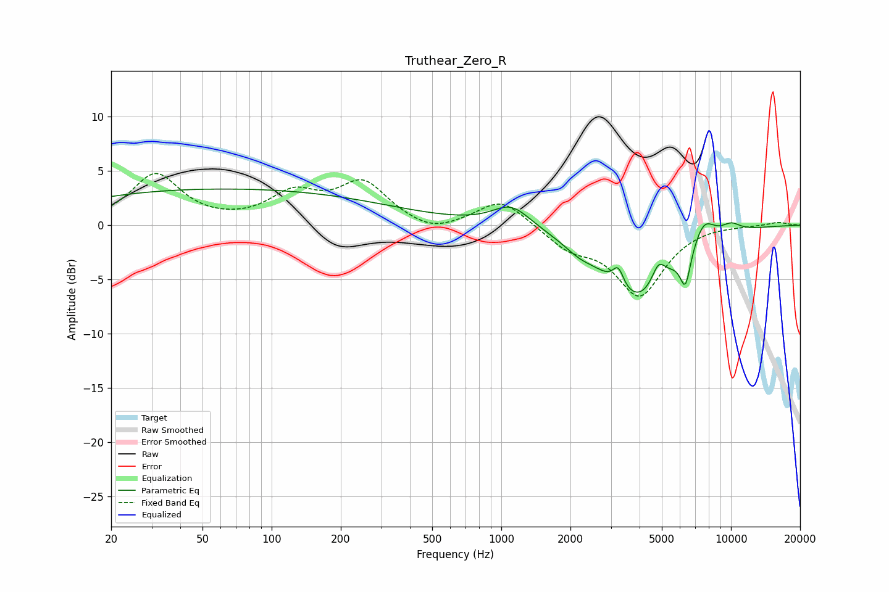

# Truthear_Zero_R
See [usage instructions](https://github.com/jaakkopasanen/AutoEq#usage) for more options and info.

### Parametric EQs
Apply preamp of -3.4 dB when using parametric equalizer.

|   # | Type    |   Fc (Hz) |    Q |   Gain (dB) |
|-----|---------|-----------|------|-------------|
|   1 | Peaking |        62 | 0.18 |         3.3 |
|   2 | Peaking |       810 | 2.38 |        -0   |
|   3 | Peaking |      1107 | 1.7  |         2   |
|   4 | Peaking |      2173 | 2.2  |        -0.7 |
|   5 | Peaking |      3229 | 5.93 |         1.8 |
|   6 | Peaking |      3930 | 0.95 |        -6.8 |
|   7 | Peaking |      4836 | 4.67 |         2   |
|   8 | Peaking |      6334 | 5.98 |        -3.3 |
|   9 | Peaking |      7620 | 2.85 |         2.2 |
|  10 | Peaking |     10000 | 2.86 |         0.8 |

### Fixed Band EQs
When using fixed band (also called graphic) equalizer, apply preamp of **-4.9 dB** (if available) and set gains manually with these parameters.

|   # | Type    |   Fc (Hz) |    Q |   Gain (dB) |
|-----|---------|-----------|------|-------------|
|   1 | Peaking |        31 | 1.41 |         4.6 |
|   2 | Peaking |        62 | 1.41 |         0   |
|   3 | Peaking |       125 | 1.41 |         2.6 |
|   4 | Peaking |       250 | 1.41 |         3.7 |
|   5 | Peaking |       500 | 1.41 |        -1   |
|   6 | Peaking |      1000 | 1.41 |         2.5 |
|   7 | Peaking |      2000 | 1.41 |        -1.9 |
|   8 | Peaking |      4000 | 1.41 |        -6.3 |
|   9 | Peaking |      8000 | 1.41 |         0.1 |
|  10 | Peaking |     16000 | 1.41 |         0.3 |

### Graphs

