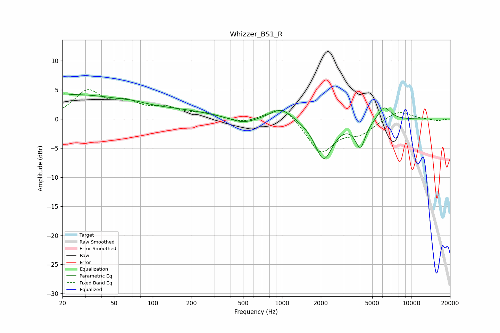

# Whizzer_BS1_R
See [usage instructions](https://github.com/jaakkopasanen/AutoEq#usage) for more options and info.

### Parametric EQs
Apply preamp of -4.4 dB when using parametric equalizer.

|   # | Type    |   Fc (Hz) |    Q |   Gain (dB) |
|-----|---------|-----------|------|-------------|
|   1 | Peaking |        21 | 5.84 |         3.2 |
|   2 | Peaking |        21 | 5.96 |        -2.9 |
|   3 | Peaking |        25 | 0.35 |         4   |
|   4 | Peaking |        70 | 1.28 |         0.5 |
|   5 | Peaking |       169 | 0.58 |         1.1 |
|   6 | Peaking |       502 | 1.47 |        -1.1 |
|   7 | Peaking |       988 | 1.65 |         2.1 |
|   8 | Peaking |      2106 | 2.06 |        -6.9 |
|   9 | Peaking |      4046 | 3.59 |        -4.5 |
|  10 | Peaking |      6181 | 2.87 |         2.5 |

### Fixed Band EQs
When using fixed band (also called graphic) equalizer, apply preamp of **-5.1 dB** (if available) and set gains manually with these parameters.

|   # | Type    |   Fc (Hz) |    Q |   Gain (dB) |
|-----|---------|-----------|------|-------------|
|   1 | Peaking |        31 | 1.41 |         4.5 |
|   2 | Peaking |        62 | 1.41 |         2.3 |
|   3 | Peaking |       125 | 1.41 |         1.6 |
|   4 | Peaking |       250 | 1.41 |         0.8 |
|   5 | Peaking |       500 | 1.41 |        -0.8 |
|   6 | Peaking |      1000 | 1.41 |         2.7 |
|   7 | Peaking |      2000 | 1.41 |        -5.8 |
|   8 | Peaking |      4000 | 1.41 |        -2.1 |
|   9 | Peaking |      8000 | 1.41 |         1.5 |
|  10 | Peaking |     16000 | 1.41 |        -0.3 |

### Graphs

