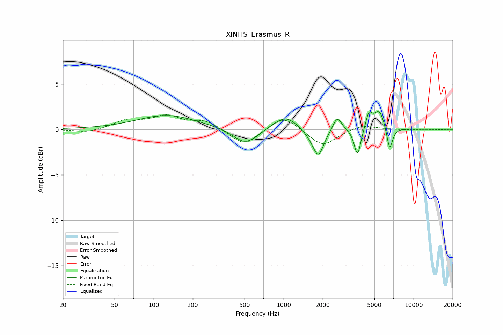

# XINHS_Erasmus_R
See [usage instructions](https://github.com/jaakkopasanen/AutoEq#usage) for more options and info.

### Parametric EQs
Apply preamp of -2.1 dB when using parametric equalizer.

|   # | Type    |   Fc (Hz) |    Q |   Gain (dB) |
|-----|---------|-----------|------|-------------|
|   1 | Peaking |       126 | 0.63 |         1.6 |
|   2 | Peaking |       507 | 1.56 |        -1.8 |
|   3 | Peaking |      1033 | 1.56 |         1.6 |
|   4 | Peaking |      1647 | 2.38 |        -0.6 |
|   5 | Peaking |      1854 | 3.47 |        -2.7 |
|   6 | Peaking |      2586 | 4.33 |         1.6 |
|   7 | Peaking |      3705 | 5.63 |        -3.1 |
|   8 | Peaking |      4529 | 6    |         1.6 |
|   9 | Peaking |      5438 | 3.28 |         2.2 |
|  10 | Peaking |      6546 | 6    |        -2.7 |

### Fixed Band EQs
When using fixed band (also called graphic) equalizer, apply preamp of **-1.7 dB** (if available) and set gains manually with these parameters.

|   # | Type    |   Fc (Hz) |    Q |   Gain (dB) |
|-----|---------|-----------|------|-------------|
|   1 | Peaking |        31 | 1.41 |        -0.4 |
|   2 | Peaking |        62 | 1.41 |         0.9 |
|   3 | Peaking |       125 | 1.41 |         1.3 |
|   4 | Peaking |       250 | 1.41 |         0.9 |
|   5 | Peaking |       500 | 1.41 |        -1.9 |
|   6 | Peaking |      1000 | 1.41 |         1.6 |
|   7 | Peaking |      2000 | 1.41 |        -1.9 |
|   8 | Peaking |      4000 | 1.41 |         0.6 |
|   9 | Peaking |      8000 | 1.41 |        -0   |
|  10 | Peaking |     16000 | 1.41 |        -0   |

### Graphs

