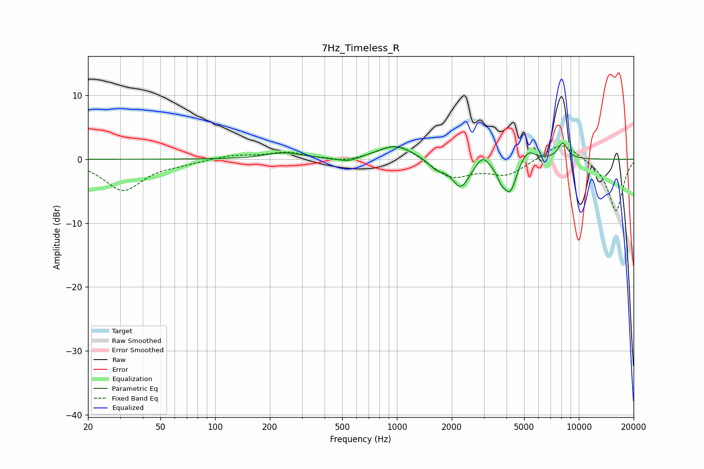

# 7Hz_Timeless_R
See [usage instructions](https://github.com/jaakkopasanen/AutoEq#usage) for more options and info.

### Parametric EQs
Apply preamp of -2.6 dB when using parametric equalizer.

|   # | Type    |   Fc (Hz) |    Q |   Gain (dB) |
|-----|---------|-----------|------|-------------|
|   1 | Peaking |       237 | 1.51 |         1   |
|   2 | Peaking |       538 | 2.5  |        -0.8 |
|   3 | Peaking |       979 | 1.43 |         2.2 |
|   4 | Peaking |      1653 | 3.11 |        -1.4 |
|   5 | Peaking |      2242 | 2.94 |        -4.3 |
|   6 | Peaking |      2950 | 4.24 |         1.6 |
|   7 | Peaking |      3736 | 5.67 |        -1.8 |
|   8 | Peaking |      4193 | 4.01 |        -4.9 |
|   9 | Peaking |      5228 | 3.43 |         2   |
|  10 | Peaking |      8156 | 4.85 |         2.5 |

### Fixed Band EQs
When using fixed band (also called graphic) equalizer, apply preamp of **-2.1 dB** (if available) and set gains manually with these parameters.

|   # | Type    |   Fc (Hz) |    Q |   Gain (dB) |
|-----|---------|-----------|------|-------------|
|   1 | Peaking |        31 | 1.41 |        -4.8 |
|   2 | Peaking |        62 | 1.41 |        -0.5 |
|   3 | Peaking |       125 | 1.41 |         0.6 |
|   4 | Peaking |       250 | 1.41 |         1.1 |
|   5 | Peaking |       500 | 1.41 |        -0.6 |
|   6 | Peaking |      1000 | 1.41 |         2.7 |
|   7 | Peaking |      2000 | 1.41 |        -2.9 |
|   8 | Peaking |      4000 | 1.41 |        -2.4 |
|   9 | Peaking |      8000 | 1.41 |         2.9 |
|  10 | Peaking |     16000 | 1.41 |        -8.2 |

### Graphs

