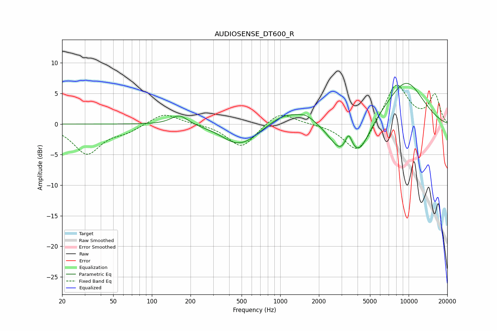

# AUDIOSENSE_DT600_R
See [usage instructions](https://github.com/jaakkopasanen/AutoEq#usage) for more options and info.

### Parametric EQs
Apply preamp of -6.7 dB when using parametric equalizer.

|   # | Type    |   Fc (Hz) |    Q |   Gain (dB) |
|-----|---------|-----------|------|-------------|
|   1 | Peaking |       164 | 2.13 |         1.7 |
|   2 | Peaking |       431 | 1.52 |        -0.7 |
|   3 | Peaking |       514 | 0.97 |        -3.1 |
|   4 | Peaking |      1101 | 0.95 |         2.2 |
|   5 | Peaking |      1605 | 2.18 |         1   |
|   6 | Peaking |      2742 | 1.75 |        -2.5 |
|   7 | Peaking |      2984 | 3.32 |        -0.9 |
|   8 | Peaking |      3410 | 5.46 |         2.4 |
|   9 | Peaking |      4098 | 1.62 |        -5.3 |
|  10 | Peaking |      9452 | 0.8  |         7   |

### Fixed Band EQs
When using fixed band (also called graphic) equalizer, apply preamp of **-6.5 dB** (if available) and set gains manually with these parameters.

|   # | Type    |   Fc (Hz) |    Q |   Gain (dB) |
|-----|---------|-----------|------|-------------|
|   1 | Peaking |        31 | 1.41 |        -4.8 |
|   2 | Peaking |        62 | 1.41 |        -1.1 |
|   3 | Peaking |       125 | 1.41 |         1.9 |
|   4 | Peaking |       250 | 1.41 |         0   |
|   5 | Peaking |       500 | 1.41 |        -3.9 |
|   6 | Peaking |      1000 | 1.41 |         2.2 |
|   7 | Peaking |      2000 | 1.41 |         0   |
|   8 | Peaking |      4000 | 1.41 |        -5.1 |
|   9 | Peaking |      8000 | 1.41 |         6.8 |
|  10 | Peaking |     16000 | 1.41 |         4.7 |

### Graphs

