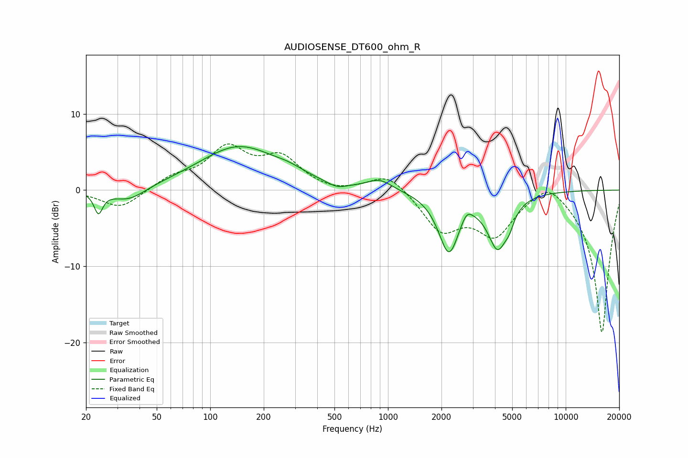

# AUDIOSENSE_DT600_ohm_R
See [usage instructions](https://github.com/jaakkopasanen/AutoEq#usage) for more options and info.

### Parametric EQs
Apply preamp of -5.8 dB when using parametric equalizer.

|   # | Type    |   Fc (Hz) |    Q |   Gain (dB) |
|-----|---------|-----------|------|-------------|
|   1 | Peaking |        23 | 6    |        -2.8 |
|   2 | Peaking |        35 | 1.47 |        -1.8 |
|   3 | Peaking |       145 | 0.63 |         5.7 |
|   4 | Peaking |       277 | 1.78 |         0.6 |
|   5 | Peaking |       516 | 2.45 |        -0.8 |
|   6 | Peaking |       899 | 2.06 |         1.3 |
|   7 | Peaking |      2202 | 2.41 |        -7.9 |
|   8 | Peaking |      2774 | 4.49 |         1.4 |
|   9 | Peaking |      4150 | 2.45 |        -7   |
|  10 | Peaking |      4826 | 6    |        -1.2 |

### Fixed Band EQs
When using fixed band (also called graphic) equalizer, apply preamp of **-6.1 dB** (if available) and set gains manually with these parameters.

|   # | Type    |   Fc (Hz) |    Q |   Gain (dB) |
|-----|---------|-----------|------|-------------|
|   1 | Peaking |        31 | 1.41 |        -2.5 |
|   2 | Peaking |        62 | 1.41 |         1.5 |
|   3 | Peaking |       125 | 1.41 |         5.1 |
|   4 | Peaking |       250 | 1.41 |         3.9 |
|   5 | Peaking |       500 | 1.41 |        -0.5 |
|   6 | Peaking |      1000 | 1.41 |         2.4 |
|   7 | Peaking |      2000 | 1.41 |        -5.1 |
|   8 | Peaking |      4000 | 1.41 |        -5.5 |
|   9 | Peaking |      8000 | 1.41 |         2.2 |
|  10 | Peaking |     16000 | 1.41 |       -18.9 |

### Graphs

