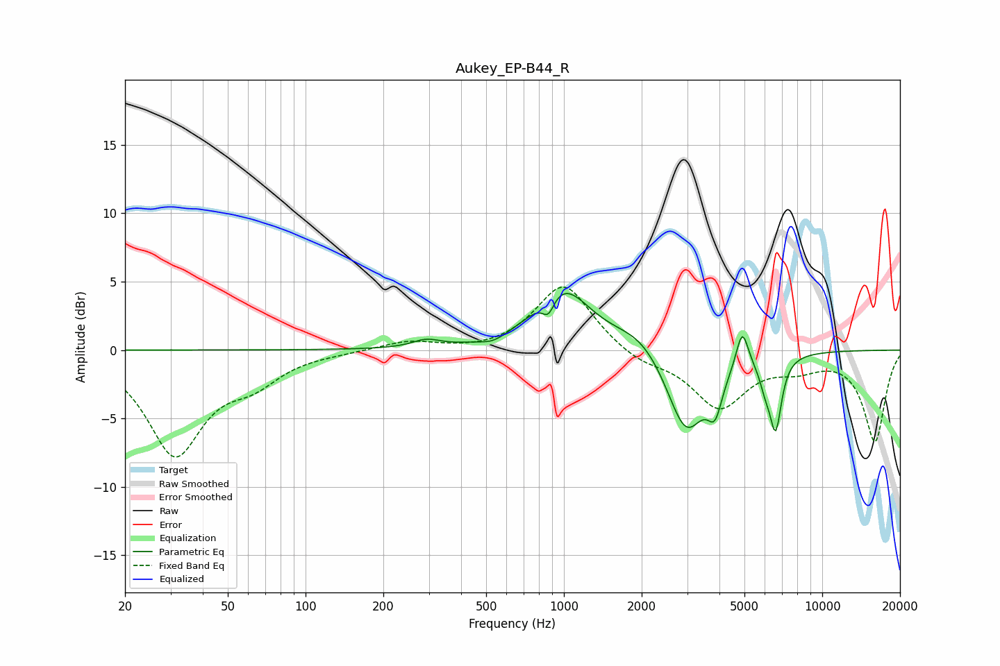

# Aukey_EP-B44_R
See [usage instructions](https://github.com/jaakkopasanen/AutoEq#usage) for more options and info.

### Parametric EQs
Apply preamp of -4.2 dB when using parametric equalizer.

|   # | Type    |   Fc (Hz) |    Q |   Gain (dB) |
|-----|---------|-----------|------|-------------|
|   1 | Peaking |       293 | 2.66 |         0.6 |
|   2 | Peaking |       533 | 2.89 |        -0.4 |
|   3 | Peaking |       870 | 6    |        -1.4 |
|   4 | Peaking |       983 | 1.3  |         4.5 |
|   5 | Peaking |      1984 | 1.38 |         1.4 |
|   6 | Peaking |      2971 | 1.86 |        -6.2 |
|   7 | Peaking |      3847 | 4.96 |        -2.7 |
|   8 | Peaking |      4903 | 6    |         2.8 |
|   9 | Peaking |      6015 | 6    |        -1.4 |
|  10 | Peaking |      6601 | 5.95 |        -5.1 |

### Fixed Band EQs
When using fixed band (also called graphic) equalizer, apply preamp of **-4.7 dB** (if available) and set gains manually with these parameters.

|   # | Type    |   Fc (Hz) |    Q |   Gain (dB) |
|-----|---------|-----------|------|-------------|
|   1 | Peaking |        31 | 1.41 |        -7.5 |
|   2 | Peaking |        62 | 1.41 |        -1.8 |
|   3 | Peaking |       125 | 1.41 |        -0.1 |
|   4 | Peaking |       250 | 1.41 |         0.7 |
|   5 | Peaking |       500 | 1.41 |        -0.2 |
|   6 | Peaking |      1000 | 1.41 |         4.9 |
|   7 | Peaking |      2000 | 1.41 |        -0.9 |
|   8 | Peaking |      4000 | 1.41 |        -4.1 |
|   9 | Peaking |      8000 | 1.41 |        -1   |
|  10 | Peaking |     16000 | 1.41 |        -6.6 |

### Graphs

