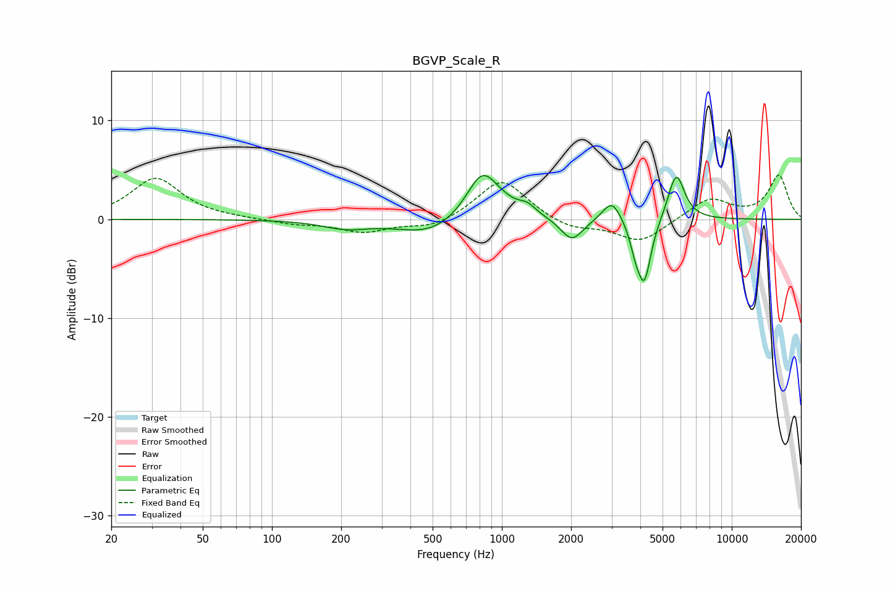

# BGVP_Scale_R
See [usage instructions](https://github.com/jaakkopasanen/AutoEq#usage) for more options and info.

### Parametric EQs
Apply preamp of -4.5 dB when using parametric equalizer.

|   # | Type    |   Fc (Hz) |    Q |   Gain (dB) |
|-----|---------|-----------|------|-------------|
|   1 | Peaking |       209 | 1.42 |        -0.8 |
|   2 | Peaking |       490 | 1.02 |        -1.7 |
|   3 | Peaking |       820 | 2.09 |         4.3 |
|   4 | Peaking |       938 | 1.32 |         1   |
|   5 | Peaking |      1292 | 3.88 |         0.8 |
|   6 | Peaking |      2015 | 2.9  |        -2.3 |
|   7 | Peaking |      3010 | 3.52 |         2.2 |
|   8 | Peaking |      3804 | 6    |        -1.8 |
|   9 | Peaking |      4163 | 4.7  |        -6.3 |
|  10 | Peaking |      5733 | 3.88 |         4.8 |

### Fixed Band EQs
When using fixed band (also called graphic) equalizer, apply preamp of **-4.6 dB** (if available) and set gains manually with these parameters.

|   # | Type    |   Fc (Hz) |    Q |   Gain (dB) |
|-----|---------|-----------|------|-------------|
|   1 | Peaking |        31 | 1.41 |         4.2 |
|   2 | Peaking |        62 | 1.41 |         0   |
|   3 | Peaking |       125 | 1.41 |        -0.5 |
|   4 | Peaking |       250 | 1.41 |        -1.3 |
|   5 | Peaking |       500 | 1.41 |        -0.9 |
|   6 | Peaking |      1000 | 1.41 |         4.2 |
|   7 | Peaking |      2000 | 1.41 |        -1   |
|   8 | Peaking |      4000 | 1.41 |        -2.3 |
|   9 | Peaking |      8000 | 1.41 |         2.1 |
|  10 | Peaking |     16000 | 1.41 |         4.4 |

### Graphs

