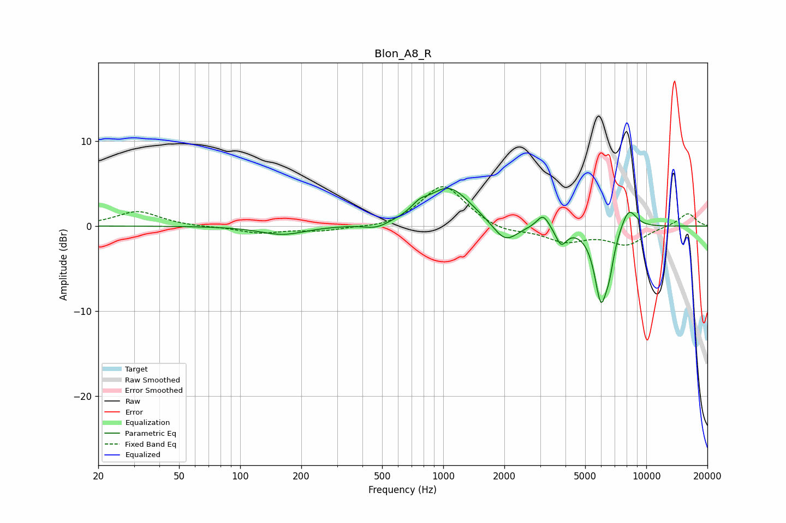

# Blon_A8_R
See [usage instructions](https://github.com/jaakkopasanen/AutoEq#usage) for more options and info.

### Parametric EQs
Apply preamp of -4.5 dB when using parametric equalizer.

|   # | Type    |   Fc (Hz) |    Q |   Gain (dB) |
|-----|---------|-----------|------|-------------|
|   1 | Peaking |       162 | 1.26 |        -1   |
|   2 | Peaking |       470 | 2.3  |        -0.7 |
|   3 | Peaking |       764 | 3.7  |         0.8 |
|   4 | Peaking |      1066 | 1.3  |         4.6 |
|   5 | Peaking |      2019 | 2.29 |        -2.4 |
|   6 | Peaking |      3103 | 4.6  |         1.7 |
|   7 | Peaking |      3806 | 5.24 |        -2   |
|   8 | Peaking |      5980 | 4.19 |        -8.4 |
|   9 | Peaking |      6580 | 6    |        -2.5 |
|  10 | Peaking |      8189 | 3.34 |         2.6 |

### Fixed Band EQs
When using fixed band (also called graphic) equalizer, apply preamp of **-4.7 dB** (if available) and set gains manually with these parameters.

|   # | Type    |   Fc (Hz) |    Q |   Gain (dB) |
|-----|---------|-----------|------|-------------|
|   1 | Peaking |        31 | 1.41 |         1.7 |
|   2 | Peaking |        62 | 1.41 |        -0.1 |
|   3 | Peaking |       125 | 1.41 |        -0.8 |
|   4 | Peaking |       250 | 1.41 |        -0.5 |
|   5 | Peaking |       500 | 1.41 |        -0.4 |
|   6 | Peaking |      1000 | 1.41 |         4.9 |
|   7 | Peaking |      2000 | 1.41 |        -0.8 |
|   8 | Peaking |      4000 | 1.41 |        -1.7 |
|   9 | Peaking |      8000 | 1.41 |        -2.1 |
|  10 | Peaking |     16000 | 1.41 |         1.6 |

### Graphs

