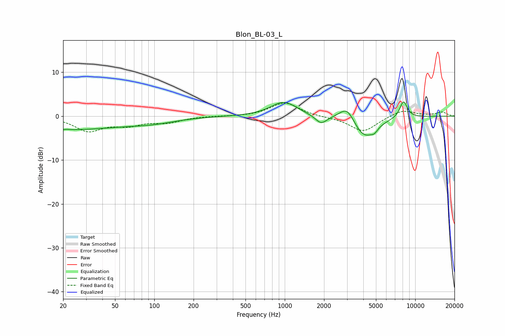

# Blon_BL-03_L
See [usage instructions](https://github.com/jaakkopasanen/AutoEq#usage) for more options and info.

### Parametric EQs
Apply preamp of -3.3 dB when using parametric equalizer.

|   # | Type    |   Fc (Hz) |    Q |   Gain (dB) |
|-----|---------|-----------|------|-------------|
|   1 | Peaking |        21 | 0.31 |        -3   |
|   2 | Peaking |        21 | 5.91 |        -2.7 |
|   3 | Peaking |        21 | 6    |         2.8 |
|   4 | Peaking |        97 | 0.79 |        -1   |
|   5 | Peaking |       984 | 1.42 |         3.3 |
|   6 | Peaking |      1899 | 3.17 |        -2   |
|   7 | Peaking |      3014 | 2.37 |         3.7 |
|   8 | Peaking |      4040 | 1.52 |        -5.3 |
|   9 | Peaking |      4860 | 5.7  |        -0.9 |
|  10 | Peaking |      8135 | 4.49 |         3.8 |

### Fixed Band EQs
When using fixed band (also called graphic) equalizer, apply preamp of **-3.1 dB** (if available) and set gains manually with these parameters.

|   # | Type    |   Fc (Hz) |    Q |   Gain (dB) |
|-----|---------|-----------|------|-------------|
|   1 | Peaking |        31 | 1.41 |        -3.2 |
|   2 | Peaking |        62 | 1.41 |        -1.7 |
|   3 | Peaking |       125 | 1.41 |        -1.3 |
|   4 | Peaking |       250 | 1.41 |         0   |
|   5 | Peaking |       500 | 1.41 |        -0.1 |
|   6 | Peaking |      1000 | 1.41 |         3.2 |
|   7 | Peaking |      2000 | 1.41 |        -0.2 |
|   8 | Peaking |      4000 | 1.41 |        -3.6 |
|   9 | Peaking |      8000 | 1.41 |         1.5 |
|  10 | Peaking |     16000 | 1.41 |         0.9 |

### Graphs

