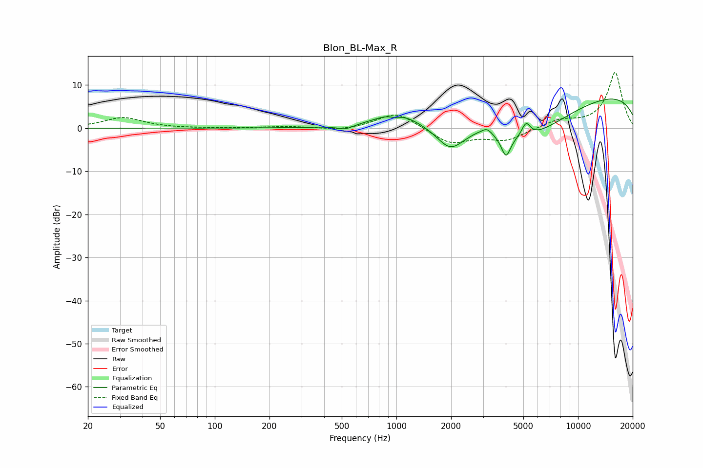

# Blon_BL-Max_R
See [usage instructions](https://github.com/jaakkopasanen/AutoEq#usage) for more options and info.

### Parametric EQs
Apply preamp of -6.8 dB when using parametric equalizer.

|   # | Type    |   Fc (Hz) |    Q |   Gain (dB) |
|-----|---------|-----------|------|-------------|
|   1 | Peaking |       522 | 3.27 |        -1   |
|   2 | Peaking |       992 | 4.71 |        -0.8 |
|   3 | Peaking |       998 | 1.3  |         3.4 |
|   4 | Peaking |      1976 | 1.83 |        -5.6 |
|   5 | Peaking |      2764 | 3.29 |         0.5 |
|   6 | Peaking |      3155 | 4.88 |         1.6 |
|   7 | Peaking |      4013 | 5.5  |        -4.9 |
|   8 | Peaking |      5165 | 0.55 |        -9.6 |
|   9 | Peaking |      5175 | 5.86 |         3.2 |
|  10 | Peaking |      9982 | 0.18 |         9.1 |

### Fixed Band EQs
When using fixed band (also called graphic) equalizer, apply preamp of **-13.0 dB** (if available) and set gains manually with these parameters.

|   # | Type    |   Fc (Hz) |    Q |   Gain (dB) |
|-----|---------|-----------|------|-------------|
|   1 | Peaking |        31 | 1.41 |         2.5 |
|   2 | Peaking |        62 | 1.41 |        -0   |
|   3 | Peaking |       125 | 1.41 |         0   |
|   4 | Peaking |       250 | 1.41 |         0.4 |
|   5 | Peaking |       500 | 1.41 |        -0.6 |
|   6 | Peaking |      1000 | 1.41 |         3.8 |
|   7 | Peaking |      2000 | 1.41 |        -3.6 |
|   8 | Peaking |      4000 | 1.41 |        -2.7 |
|   9 | Peaking |      8000 | 1.41 |         1.7 |
|  10 | Peaking |     16000 | 1.41 |        13   |

### Graphs

