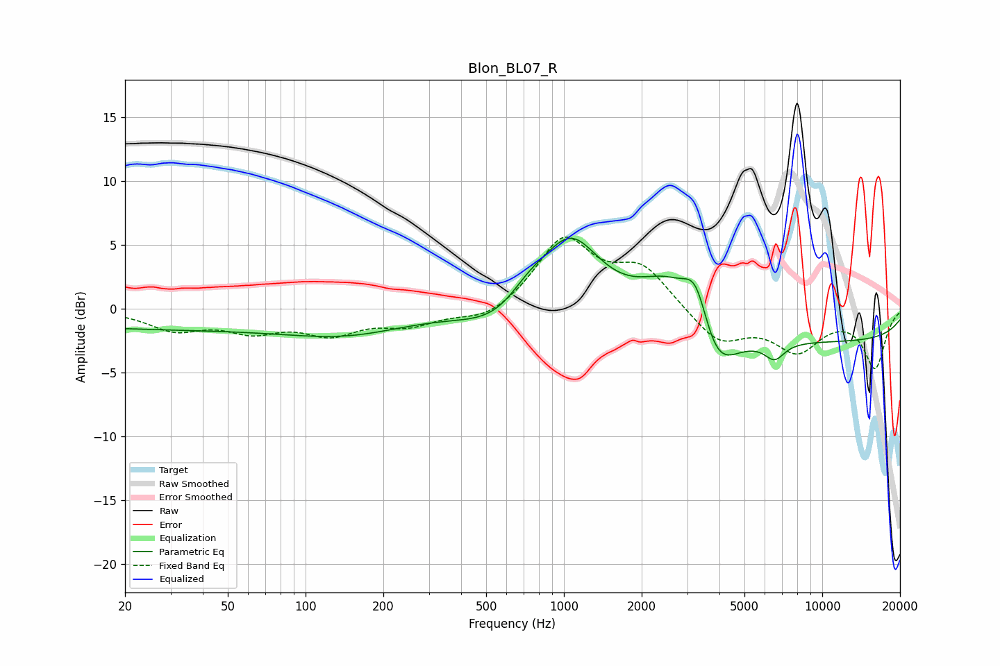

# Blon_BL07_R
See [usage instructions](https://github.com/jaakkopasanen/AutoEq#usage) for more options and info.

### Parametric EQs
Apply preamp of -5.6 dB when using parametric equalizer.

|   # | Type    |   Fc (Hz) |    Q |   Gain (dB) |
|-----|---------|-----------|------|-------------|
|   1 | Peaking |        31 | 0.18 |        -1.5 |
|   2 | Peaking |       150 | 0.64 |        -1.2 |
|   3 | Peaking |       554 | 1.03 |        -1.6 |
|   4 | Peaking |       725 | 1.85 |         1.3 |
|   5 | Peaking |      1060 | 1.22 |         5.8 |
|   6 | Peaking |      2522 | 1.23 |         3.3 |
|   7 | Peaking |      3253 | 2.78 |         4.1 |
|   8 | Peaking |      3835 | 1.7  |        -4.4 |
|   9 | Peaking |      6538 | 3.47 |        -1.4 |
|  10 | Peaking |     10000 | 0.18 |        -2.5 |

### Fixed Band EQs
When using fixed band (also called graphic) equalizer, apply preamp of **-5.7 dB** (if available) and set gains manually with these parameters.

|   # | Type    |   Fc (Hz) |    Q |   Gain (dB) |
|-----|---------|-----------|------|-------------|
|   1 | Peaking |        31 | 1.41 |        -1.5 |
|   2 | Peaking |        62 | 1.41 |        -1.5 |
|   3 | Peaking |       125 | 1.41 |        -1.8 |
|   4 | Peaking |       250 | 1.41 |        -1.2 |
|   5 | Peaking |       500 | 1.41 |        -1.1 |
|   6 | Peaking |      1000 | 1.41 |         5.4 |
|   7 | Peaking |      2000 | 1.41 |         3.1 |
|   8 | Peaking |      4000 | 1.41 |        -2.6 |
|   9 | Peaking |      8000 | 1.41 |        -3   |
|  10 | Peaking |     16000 | 1.41 |        -4.5 |

### Graphs

