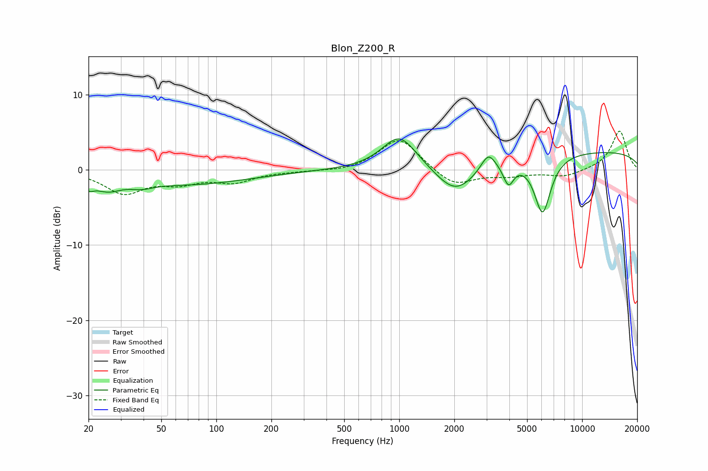

# Blon_Z200_R
See [usage instructions](https://github.com/jaakkopasanen/AutoEq#usage) for more options and info.

### Parametric EQs
Apply preamp of -4.2 dB when using parametric equalizer.

|   # | Type    |   Fc (Hz) |    Q |   Gain (dB) |
|-----|---------|-----------|------|-------------|
|   1 | Peaking |        20 | 4.75 |        -1.2 |
|   2 | Peaking |        25 | 1.88 |        -1.8 |
|   3 | Peaking |        39 | 2.06 |        -0.8 |
|   4 | Peaking |        73 | 0.44 |        -1.8 |
|   5 | Peaking |      1002 | 1.5  |         4.6 |
|   6 | Peaking |      2034 | 1.28 |        -4.1 |
|   7 | Peaking |      3069 | 3.64 |         2.3 |
|   8 | Peaking |      3957 | 4.87 |        -2.9 |
|   9 | Peaking |      6076 | 3.01 |        -7.7 |
|  10 | Peaking |     10000 | 0.18 |         2.5 |

### Fixed Band EQs
When using fixed band (also called graphic) equalizer, apply preamp of **-5.3 dB** (if available) and set gains manually with these parameters.

|   # | Type    |   Fc (Hz) |    Q |   Gain (dB) |
|-----|---------|-----------|------|-------------|
|   1 | Peaking |        31 | 1.41 |        -3   |
|   2 | Peaking |        62 | 1.41 |        -1.4 |
|   3 | Peaking |       125 | 1.41 |        -1.5 |
|   4 | Peaking |       250 | 1.41 |        -0.1 |
|   5 | Peaking |       500 | 1.41 |        -0.3 |
|   6 | Peaking |      1000 | 1.41 |         4.4 |
|   7 | Peaking |      2000 | 1.41 |        -2.2 |
|   8 | Peaking |      4000 | 1.41 |        -0.7 |
|   9 | Peaking |      8000 | 1.41 |        -0.9 |
|  10 | Peaking |     16000 | 1.41 |         5.2 |

### Graphs

