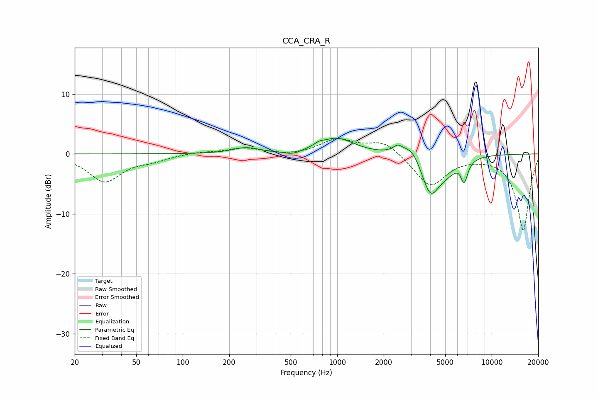

# CCA_CRA_R
See [usage instructions](https://github.com/jaakkopasanen/AutoEq#usage) for more options and info.

### Parametric EQs
Apply preamp of -2.7 dB when using parametric equalizer.

|   # | Type    |   Fc (Hz) |    Q |   Gain (dB) |
|-----|---------|-----------|------|-------------|
|   1 | Peaking |       255 | 1.66 |         1   |
|   2 | Peaking |       515 | 2.58 |        -0.6 |
|   3 | Peaking |       761 | 4.88 |         0.4 |
|   4 | Peaking |       989 | 1.27 |         2.6 |
|   5 | Peaking |      2462 | 4.49 |         1.1 |
|   6 | Peaking |      3050 | 2.31 |         2.4 |
|   7 | Peaking |      4004 | 2.35 |        -6.6 |
|   8 | Peaking |      5130 | 2.01 |        -1.8 |
|   9 | Peaking |      6289 | 5.54 |         0.5 |
|  10 | Peaking |      6621 | 5.82 |        -3.8 |

### Fixed Band EQs
When using fixed band (also called graphic) equalizer, apply preamp of **-2.7 dB** (if available) and set gains manually with these parameters.

|   # | Type    |   Fc (Hz) |    Q |   Gain (dB) |
|-----|---------|-----------|------|-------------|
|   1 | Peaking |        31 | 1.41 |        -4.5 |
|   2 | Peaking |        62 | 1.41 |        -0.9 |
|   3 | Peaking |       125 | 1.41 |         0.3 |
|   4 | Peaking |       250 | 1.41 |         1   |
|   5 | Peaking |       500 | 1.41 |        -0.3 |
|   6 | Peaking |      1000 | 1.41 |         2.4 |
|   7 | Peaking |      2000 | 1.41 |         2.2 |
|   8 | Peaking |      4000 | 1.41 |        -5.4 |
|   9 | Peaking |      8000 | 1.41 |        -0.2 |
|  10 | Peaking |     16000 | 1.41 |       -12.8 |

### Graphs

