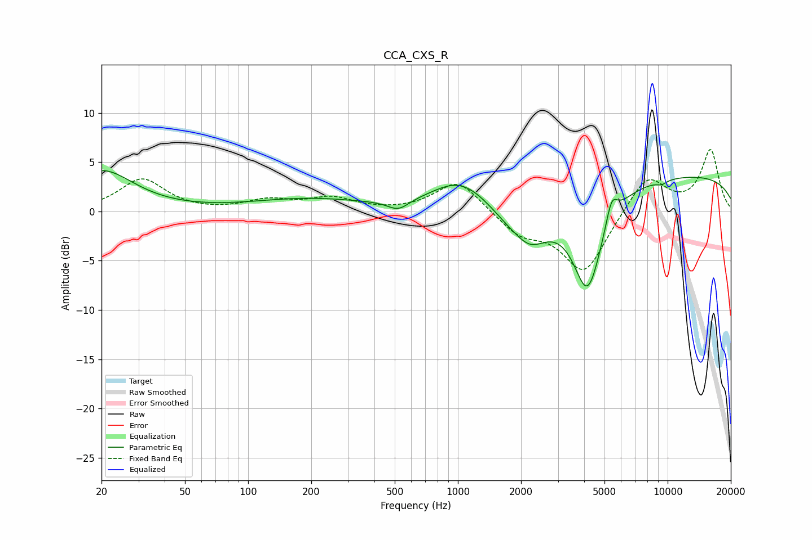

# CCA_CXS_R
See [usage instructions](https://github.com/jaakkopasanen/AutoEq#usage) for more options and info.

### Parametric EQs
Apply preamp of -4.3 dB when using parametric equalizer.

|   # | Type    |   Fc (Hz) |    Q |   Gain (dB) |
|-----|---------|-----------|------|-------------|
|   1 | Peaking |        20 | 0.94 |         4.1 |
|   2 | Peaking |       191 | 0.53 |         1.2 |
|   3 | Peaking |       520 | 2.82 |        -1   |
|   4 | Peaking |      1029 | 1.03 |         3   |
|   5 | Peaking |      1965 | 2.35 |         1.2 |
|   6 | Peaking |      2084 | 1.38 |        -5.8 |
|   7 | Peaking |      4156 | 1.9  |       -10.1 |
|   8 | Peaking |      5407 | 5.19 |         2.5 |
|   9 | Peaking |      9359 | 4.92 |        -0.4 |
|  10 | Peaking |     10000 | 0.18 |         3.8 |

### Fixed Band EQs
When using fixed band (also called graphic) equalizer, apply preamp of **-6.4 dB** (if available) and set gains manually with these parameters.

|   # | Type    |   Fc (Hz) |    Q |   Gain (dB) |
|-----|---------|-----------|------|-------------|
|   1 | Peaking |        31 | 1.41 |         3.3 |
|   2 | Peaking |        62 | 1.41 |        -0.1 |
|   3 | Peaking |       125 | 1.41 |         1   |
|   4 | Peaking |       250 | 1.41 |         1.3 |
|   5 | Peaking |       500 | 1.41 |        -0.1 |
|   6 | Peaking |      1000 | 1.41 |         3.2 |
|   7 | Peaking |      2000 | 1.41 |        -2.2 |
|   8 | Peaking |      4000 | 1.41 |        -6.2 |
|   9 | Peaking |      8000 | 1.41 |         3.8 |
|  10 | Peaking |     16000 | 1.41 |         6.2 |

### Graphs

