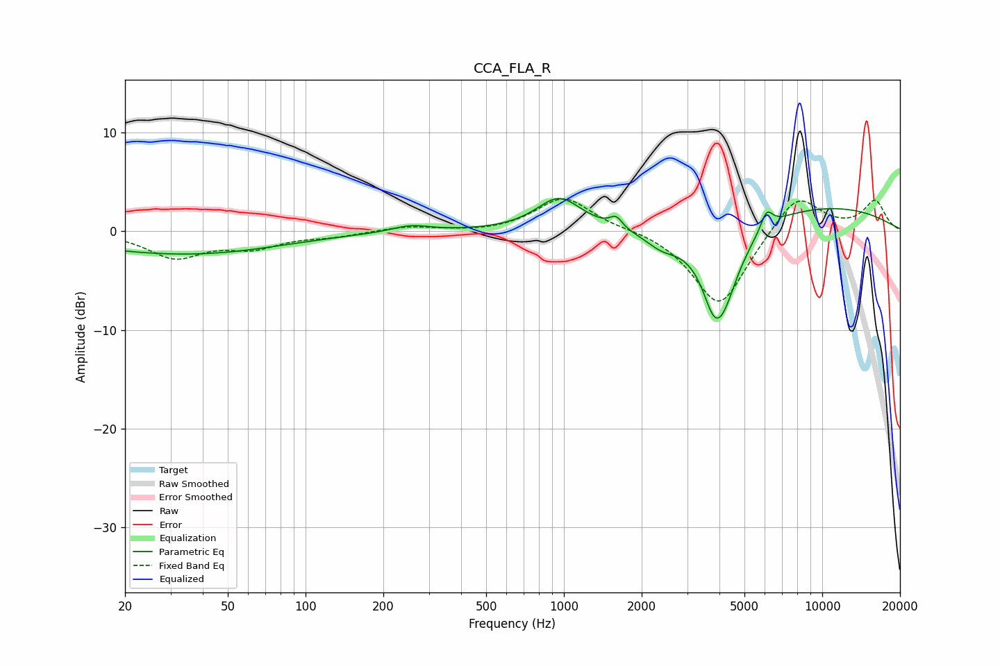

# CCA_FLA_R
See [usage instructions](https://github.com/jaakkopasanen/AutoEq#usage) for more options and info.

### Parametric EQs
Apply preamp of -3.4 dB when using parametric equalizer.

|   # | Type    |   Fc (Hz) |    Q |   Gain (dB) |
|-----|---------|-----------|------|-------------|
|   1 | Peaking |        24 | 0.43 |        -1.6 |
|   2 | Peaking |        53 | 0.51 |        -1.1 |
|   3 | Peaking |       255 | 1.88 |         0.7 |
|   4 | Peaking |       958 | 1.62 |         3.3 |
|   5 | Peaking |      1593 | 6    |         1.1 |
|   6 | Peaking |      2395 | 2.06 |        -1.5 |
|   7 | Peaking |      3758 | 4.61 |        -1.3 |
|   8 | Peaking |      4028 | 1.98 |        -9.5 |
|   9 | Peaking |      6096 | 5.99 |         1.9 |
|  10 | Peaking |      9007 | 0.33 |         2.7 |

### Fixed Band EQs
When using fixed band (also called graphic) equalizer, apply preamp of **-3.4 dB** (if available) and set gains manually with these parameters.

|   # | Type    |   Fc (Hz) |    Q |   Gain (dB) |
|-----|---------|-----------|------|-------------|
|   1 | Peaking |        31 | 1.41 |        -2.5 |
|   2 | Peaking |        62 | 1.41 |        -1.4 |
|   3 | Peaking |       125 | 1.41 |        -0.4 |
|   4 | Peaking |       250 | 1.41 |         0.5 |
|   5 | Peaking |       500 | 1.41 |        -0.2 |
|   6 | Peaking |      1000 | 1.41 |         3.5 |
|   7 | Peaking |      2000 | 1.41 |         0.3 |
|   8 | Peaking |      4000 | 1.41 |        -7.8 |
|   9 | Peaking |      8000 | 1.41 |         4   |
|  10 | Peaking |     16000 | 1.41 |         3   |

### Graphs

