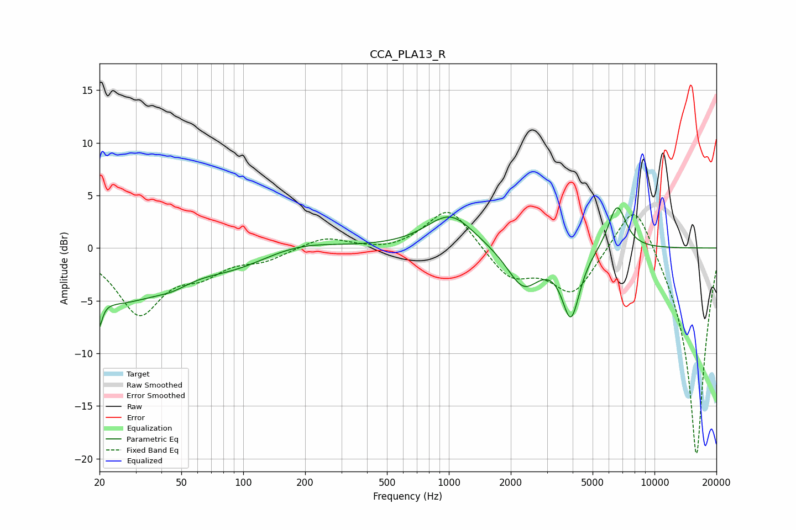

# CCA_PLA13_R
See [usage instructions](https://github.com/jaakkopasanen/AutoEq#usage) for more options and info.

### Parametric EQs
Apply preamp of -3.9 dB when using parametric equalizer.

|   # | Type    |   Fc (Hz) |    Q |   Gain (dB) |
|-----|---------|-----------|------|-------------|
|   1 | Peaking |        20 | 5.97 |        -6   |
|   2 | Peaking |        20 | 5.9  |         3.2 |
|   3 | Peaking |        25 | 0.61 |        -4.7 |
|   4 | Peaking |        45 | 1.62 |        -0.8 |
|   5 | Peaking |        91 | 0.86 |        -1.3 |
|   6 | Peaking |       193 | 0.85 |         0.7 |
|   7 | Peaking |      1017 | 1.23 |         3.3 |
|   8 | Peaking |      2303 | 1.79 |        -3.8 |
|   9 | Peaking |      3922 | 3.22 |        -6.3 |
|  10 | Peaking |      6573 | 3.1  |         4.4 |

### Fixed Band EQs
When using fixed band (also called graphic) equalizer, apply preamp of **-3.5 dB** (if available) and set gains manually with these parameters.

|   # | Type    |   Fc (Hz) |    Q |   Gain (dB) |
|-----|---------|-----------|------|-------------|
|   1 | Peaking |        31 | 1.41 |        -6   |
|   2 | Peaking |        62 | 1.41 |        -1.9 |
|   3 | Peaking |       125 | 1.41 |        -1   |
|   4 | Peaking |       250 | 1.41 |         1.1 |
|   5 | Peaking |       500 | 1.41 |        -0.4 |
|   6 | Peaking |      1000 | 1.41 |         4   |
|   7 | Peaking |      2000 | 1.41 |        -2.8 |
|   8 | Peaking |      4000 | 1.41 |        -4.2 |
|   9 | Peaking |      8000 | 1.41 |         5.6 |
|  10 | Peaking |     16000 | 1.41 |       -20   |

### Graphs

