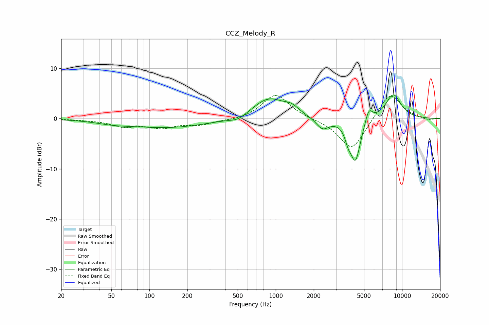

# CCZ_Melody_R
See [usage instructions](https://github.com/jaakkopasanen/AutoEq#usage) for more options and info.

### Parametric EQs
Apply preamp of -4.8 dB when using parametric equalizer.

|   # | Type    |   Fc (Hz) |    Q |   Gain (dB) |
|-----|---------|-----------|------|-------------|
|   1 | Peaking |        51 | 1.07 |        -0.5 |
|   2 | Peaking |       142 | 0.43 |        -1.8 |
|   3 | Peaking |       505 | 2.03 |        -1   |
|   4 | Peaking |       880 | 1.09 |         4.1 |
|   5 | Peaking |      1338 | 2.5  |         1.2 |
|   6 | Peaking |      2343 | 2.75 |        -2.3 |
|   7 | Peaking |      3743 | 6    |        -1.9 |
|   8 | Peaking |      4274 | 3.36 |        -8.5 |
|   9 | Peaking |      5451 | 4.97 |         2.8 |
|  10 | Peaking |      8521 | 2.05 |         4.9 |

### Fixed Band EQs
When using fixed band (also called graphic) equalizer, apply preamp of **-4.7 dB** (if available) and set gains manually with these parameters.

|   # | Type    |   Fc (Hz) |    Q |   Gain (dB) |
|-----|---------|-----------|------|-------------|
|   1 | Peaking |        31 | 1.41 |        -0.2 |
|   2 | Peaking |        62 | 1.41 |        -1.4 |
|   3 | Peaking |       125 | 1.41 |        -1.6 |
|   4 | Peaking |       250 | 1.41 |        -1.1 |
|   5 | Peaking |       500 | 1.41 |        -0.4 |
|   6 | Peaking |      1000 | 1.41 |         4.9 |
|   7 | Peaking |      2000 | 1.41 |        -0.1 |
|   8 | Peaking |      4000 | 1.41 |        -6.5 |
|   9 | Peaking |      8000 | 1.41 |         5.4 |
|  10 | Peaking |     16000 | 1.41 |        -0.4 |

### Graphs

