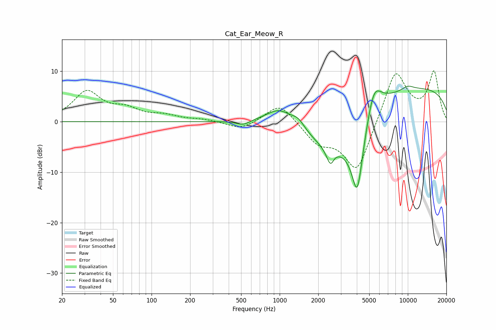

# Cat_Ear_Meow_R
See [usage instructions](https://github.com/jaakkopasanen/AutoEq#usage) for more options and info.

### Parametric EQs
Apply preamp of -7.1 dB when using parametric equalizer.

|   # | Type    |   Fc (Hz) |    Q |   Gain (dB) |
|-----|---------|-----------|------|-------------|
|   1 | Peaking |       519 | 2.8  |        -0.9 |
|   2 | Peaking |       998 | 1.32 |         3.4 |
|   3 | Peaking |      1396 | 2.83 |         1.6 |
|   4 | Peaking |      2460 | 0.66 |        -7.4 |
|   5 | Peaking |      2501 | 4.5  |        -3.6 |
|   6 | Peaking |      2647 | 6    |         0.6 |
|   7 | Peaking |      4035 | 2.46 |       -16.1 |
|   8 | Peaking |      5421 | 2.28 |         6.8 |
|   9 | Peaking |      9702 | 0.18 |         7.1 |
|  10 | Peaking |     10000 | 2.7  |         0.8 |

### Fixed Band EQs
When using fixed band (also called graphic) equalizer, apply preamp of **-10.2 dB** (if available) and set gains manually with these parameters.

|   # | Type    |   Fc (Hz) |    Q |   Gain (dB) |
|-----|---------|-----------|------|-------------|
|   1 | Peaking |        31 | 1.41 |         5.8 |
|   2 | Peaking |        62 | 1.41 |         2.1 |
|   3 | Peaking |       125 | 1.41 |         1   |
|   4 | Peaking |       250 | 1.41 |         0.4 |
|   5 | Peaking |       500 | 1.41 |        -1.6 |
|   6 | Peaking |      1000 | 1.41 |         3.9 |
|   7 | Peaking |      2000 | 1.41 |        -3.8 |
|   8 | Peaking |      4000 | 1.41 |       -10.3 |
|   9 | Peaking |      8000 | 1.41 |        10.6 |
|  10 | Peaking |     16000 | 1.41 |         9.6 |

### Graphs

