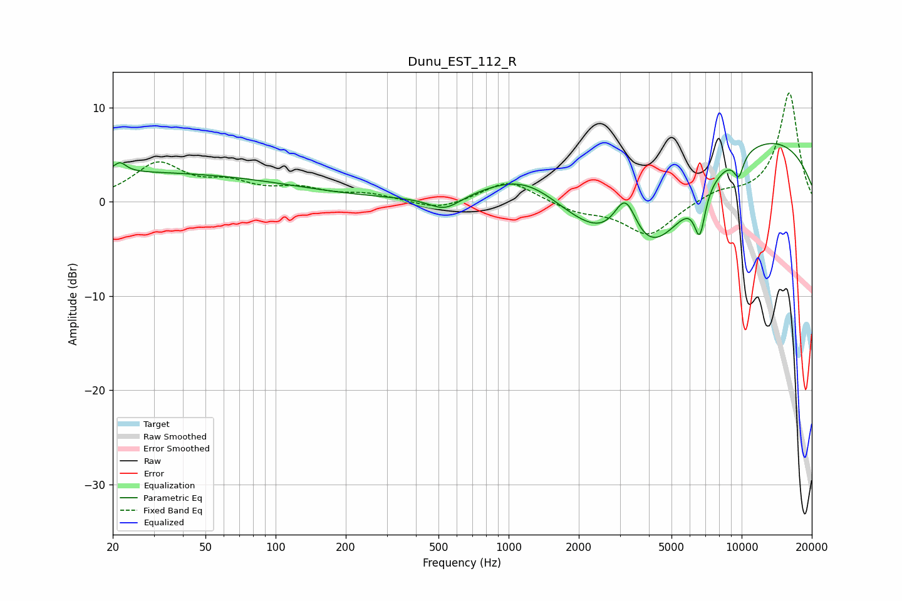

# Dunu_EST_112_R
See [usage instructions](https://github.com/jaakkopasanen/AutoEq#usage) for more options and info.

### Parametric EQs
Apply preamp of -6.3 dB when using parametric equalizer.

|   # | Type    |   Fc (Hz) |    Q |   Gain (dB) |
|-----|---------|-----------|------|-------------|
|   1 | Peaking |        21 | 5.38 |         1   |
|   2 | Peaking |        23 | 0.18 |         3.1 |
|   3 | Peaking |       532 | 2.04 |        -1.5 |
|   4 | Peaking |      1211 | 0.73 |         5   |
|   5 | Peaking |      2189 | 0.47 |        -4.7 |
|   6 | Peaking |      3175 | 2.67 |         5.5 |
|   7 | Peaking |      3996 | 0.7  |        -9.4 |
|   8 | Peaking |      6610 | 5.84 |        -4.5 |
|   9 | Peaking |      9136 | 0.22 |         8.1 |
|  10 | Peaking |      9713 | 5.83 |        -2.3 |

### Fixed Band EQs
When using fixed band (also called graphic) equalizer, apply preamp of **-11.6 dB** (if available) and set gains manually with these parameters.

|   # | Type    |   Fc (Hz) |    Q |   Gain (dB) |
|-----|---------|-----------|------|-------------|
|   1 | Peaking |        31 | 1.41 |         3.9 |
|   2 | Peaking |        62 | 1.41 |         1.6 |
|   3 | Peaking |       125 | 1.41 |         1.2 |
|   4 | Peaking |       250 | 1.41 |         0.7 |
|   5 | Peaking |       500 | 1.41 |        -1   |
|   6 | Peaking |      1000 | 1.41 |         2.3 |
|   7 | Peaking |      2000 | 1.41 |        -1   |
|   8 | Peaking |      4000 | 1.41 |        -3.6 |
|   9 | Peaking |      8000 | 1.41 |         1   |
|  10 | Peaking |     16000 | 1.41 |        11.6 |

### Graphs

