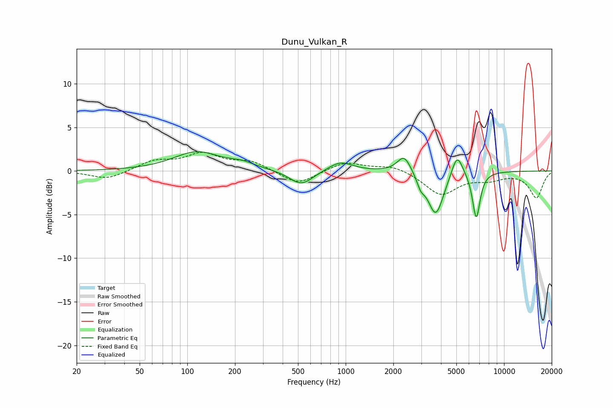

# Dunu_Vulkan_R
See [usage instructions](https://github.com/jaakkopasanen/AutoEq#usage) for more options and info.

### Parametric EQs
Apply preamp of -2.3 dB when using parametric equalizer.

|   # | Type    |   Fc (Hz) |    Q |   Gain (dB) |
|-----|---------|-----------|------|-------------|
|   1 | Peaking |       115 | 0.96 |         2.1 |
|   2 | Peaking |       222 | 1.75 |         0.6 |
|   3 | Peaking |       520 | 1.97 |        -1.5 |
|   4 | Peaking |       555 | 1.71 |        -0.3 |
|   5 | Peaking |       926 | 1.86 |         1.1 |
|   6 | Peaking |      2341 | 3.25 |         2.1 |
|   7 | Peaking |      2981 | 5.87 |        -1.1 |
|   8 | Peaking |      3705 | 2.82 |        -5.1 |
|   9 | Peaking |      5056 | 3.93 |         2.7 |
|  10 | Peaking |      6679 | 5.7  |        -5.4 |

### Fixed Band EQs
When using fixed band (also called graphic) equalizer, apply preamp of **-2.2 dB** (if available) and set gains manually with these parameters.

|   # | Type    |   Fc (Hz) |    Q |   Gain (dB) |
|-----|---------|-----------|------|-------------|
|   1 | Peaking |        31 | 1.41 |        -1   |
|   2 | Peaking |        62 | 1.41 |         1.1 |
|   3 | Peaking |       125 | 1.41 |         1.8 |
|   4 | Peaking |       250 | 1.41 |         1   |
|   5 | Peaking |       500 | 1.41 |        -1.6 |
|   6 | Peaking |      1000 | 1.41 |         1.1 |
|   7 | Peaking |      2000 | 1.41 |         0.7 |
|   8 | Peaking |      4000 | 1.41 |        -2.7 |
|   9 | Peaking |      8000 | 1.41 |        -0.8 |
|  10 | Peaking |     16000 | 1.41 |        -3   |

### Graphs

