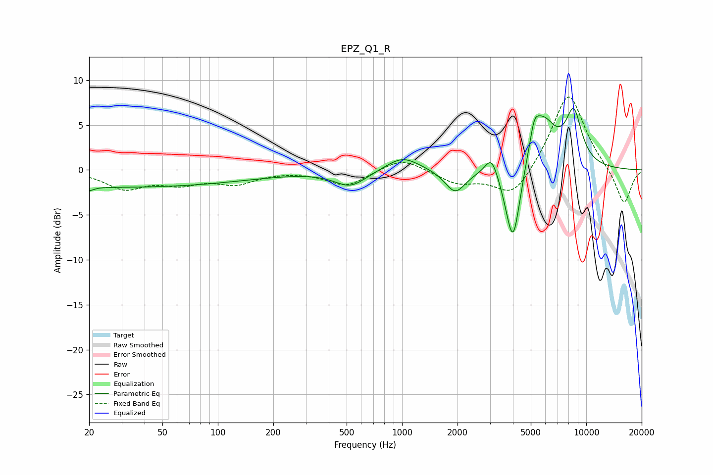

# EPZ_Q1_R
See [usage instructions](https://github.com/jaakkopasanen/AutoEq#usage) for more options and info.

### Parametric EQs
Apply preamp of -6.9 dB when using parametric equalizer.

|   # | Type    |   Fc (Hz) |    Q |   Gain (dB) |
|-----|---------|-----------|------|-------------|
|   1 | Peaking |        20 | 5.88 |        -0.4 |
|   2 | Peaking |        29 | 0.18 |        -1.9 |
|   3 | Peaking |       525 | 1.64 |        -1.8 |
|   4 | Peaking |      1008 | 1.57 |         1.6 |
|   5 | Peaking |      1943 | 2.54 |        -2.6 |
|   6 | Peaking |      3063 | 4    |         2.4 |
|   7 | Peaking |      4004 | 3.29 |        -9.5 |
|   8 | Peaking |      5221 | 5.95 |         2.1 |
|   9 | Peaking |      5726 | 1.78 |         5.9 |
|  10 | Peaking |      8552 | 2.94 |         5.6 |

### Fixed Band EQs
When using fixed band (also called graphic) equalizer, apply preamp of **-8.2 dB** (if available) and set gains manually with these parameters.

|   # | Type    |   Fc (Hz) |    Q |   Gain (dB) |
|-----|---------|-----------|------|-------------|
|   1 | Peaking |        31 | 1.41 |        -2   |
|   2 | Peaking |        62 | 1.41 |        -1.3 |
|   3 | Peaking |       125 | 1.41 |        -1.4 |
|   4 | Peaking |       250 | 1.41 |        -0   |
|   5 | Peaking |       500 | 1.41 |        -1.8 |
|   6 | Peaking |      1000 | 1.41 |         1.5 |
|   7 | Peaking |      2000 | 1.41 |        -1.4 |
|   8 | Peaking |      4000 | 1.41 |        -3.3 |
|   9 | Peaking |      8000 | 1.41 |         8.8 |
|  10 | Peaking |     16000 | 1.41 |        -4   |

### Graphs

