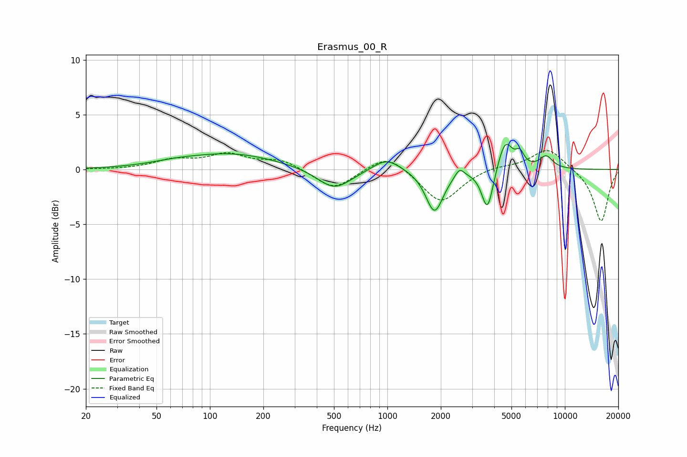

# Erasmus_00_R
See [usage instructions](https://github.com/jaakkopasanen/AutoEq#usage) for more options and info.

### Parametric EQs
Apply preamp of -2.4 dB when using parametric equalizer.

|   # | Type    |   Fc (Hz) |    Q |   Gain (dB) |
|-----|---------|-----------|------|-------------|
|   1 | Peaking |        63 | 1.03 |         0.3 |
|   2 | Peaking |       133 | 0.55 |         1.4 |
|   3 | Peaking |       503 | 1.47 |        -1.9 |
|   4 | Peaking |       990 | 1.83 |         1.2 |
|   5 | Peaking |      1842 | 2.89 |        -3.9 |
|   6 | Peaking |      2549 | 5.57 |         0.9 |
|   7 | Peaking |      3664 | 4.34 |        -3.9 |
|   8 | Peaking |      4609 | 3.37 |         2.8 |
|   9 | Peaking |      5578 | 6    |         1.1 |
|  10 | Peaking |      7843 | 3.54 |         1.1 |

### Fixed Band EQs
When using fixed band (also called graphic) equalizer, apply preamp of **-1.8 dB** (if available) and set gains manually with these parameters.

|   # | Type    |   Fc (Hz) |    Q |   Gain (dB) |
|-----|---------|-----------|------|-------------|
|   1 | Peaking |        31 | 1.41 |        -0   |
|   2 | Peaking |        62 | 1.41 |         0.8 |
|   3 | Peaking |       125 | 1.41 |         1.3 |
|   4 | Peaking |       250 | 1.41 |         0.9 |
|   5 | Peaking |       500 | 1.41 |        -1.9 |
|   6 | Peaking |      1000 | 1.41 |         1.6 |
|   7 | Peaking |      2000 | 1.41 |        -3.1 |
|   8 | Peaking |      4000 | 1.41 |         0.3 |
|   9 | Peaking |      8000 | 1.41 |         2   |
|  10 | Peaking |     16000 | 1.41 |        -4.8 |

### Graphs

