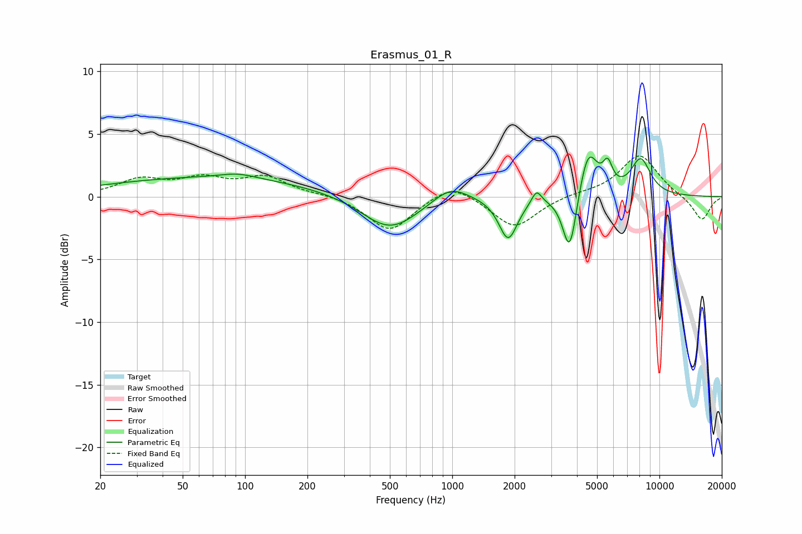

# Erasmus_01_R
See [usage instructions](https://github.com/jaakkopasanen/AutoEq#usage) for more options and info.

### Parametric EQs
Apply preamp of -3.3 dB when using parametric equalizer.

|   # | Type    |   Fc (Hz) |    Q |   Gain (dB) |
|-----|---------|-----------|------|-------------|
|   1 | Peaking |        69 | 0.26 |         1.5 |
|   2 | Peaking |        92 | 1.62 |         0.4 |
|   3 | Peaking |       500 | 1.03 |        -2.8 |
|   4 | Peaking |       980 | 1.65 |         1.3 |
|   5 | Peaking |      1862 | 3.18 |        -3.4 |
|   6 | Peaking |      2553 | 5.99 |         1.1 |
|   7 | Peaking |      3690 | 4.18 |        -5   |
|   8 | Peaking |      4530 | 3.13 |         3.9 |
|   9 | Peaking |      5629 | 6    |         1.8 |
|  10 | Peaking |      8119 | 2.72 |         2.9 |

### Fixed Band EQs
When using fixed band (also called graphic) equalizer, apply preamp of **-3.3 dB** (if available) and set gains manually with these parameters.

|   # | Type    |   Fc (Hz) |    Q |   Gain (dB) |
|-----|---------|-----------|------|-------------|
|   1 | Peaking |        31 | 1.41 |         1.3 |
|   2 | Peaking |        62 | 1.41 |         1.3 |
|   3 | Peaking |       125 | 1.41 |         1.5 |
|   4 | Peaking |       250 | 1.41 |         0.2 |
|   5 | Peaking |       500 | 1.41 |        -2.8 |
|   6 | Peaking |      1000 | 1.41 |         1.3 |
|   7 | Peaking |      2000 | 1.41 |        -2.5 |
|   8 | Peaking |      4000 | 1.41 |         0.2 |
|   9 | Peaking |      8000 | 1.41 |         3.4 |
|  10 | Peaking |     16000 | 1.41 |        -1.9 |

### Graphs

