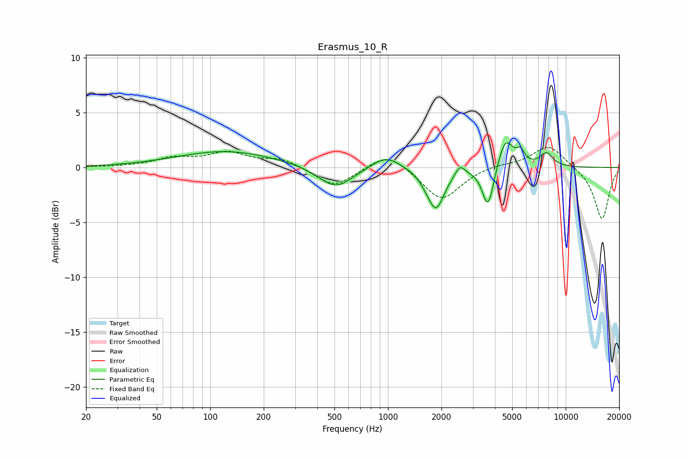

# Erasmus_10_R
See [usage instructions](https://github.com/jaakkopasanen/AutoEq#usage) for more options and info.

### Parametric EQs
Apply preamp of -2.3 dB when using parametric equalizer.

|   # | Type    |   Fc (Hz) |    Q |   Gain (dB) |
|-----|---------|-----------|------|-------------|
|   1 | Peaking |       123 | 0.51 |         1.5 |
|   2 | Peaking |       507 | 1.49 |        -2   |
|   3 | Peaking |       975 | 1.8  |         1.2 |
|   4 | Peaking |      1624 | 3.74 |        -0.3 |
|   5 | Peaking |      1863 | 3.01 |        -3.6 |
|   6 | Peaking |      2543 | 5.66 |         0.9 |
|   7 | Peaking |      3656 | 4.39 |        -3.9 |
|   8 | Peaking |      4581 | 3.31 |         2.8 |
|   9 | Peaking |      5572 | 6    |         1.1 |
|  10 | Peaking |      7804 | 3.59 |         1.2 |

### Fixed Band EQs
When using fixed band (also called graphic) equalizer, apply preamp of **-1.9 dB** (if available) and set gains manually with these parameters.

|   # | Type    |   Fc (Hz) |    Q |   Gain (dB) |
|-----|---------|-----------|------|-------------|
|   1 | Peaking |        31 | 1.41 |         0   |
|   2 | Peaking |        62 | 1.41 |         0.8 |
|   3 | Peaking |       125 | 1.41 |         1.2 |
|   4 | Peaking |       250 | 1.41 |         0.8 |
|   5 | Peaking |       500 | 1.41 |        -1.8 |
|   6 | Peaking |      1000 | 1.41 |         1.5 |
|   7 | Peaking |      2000 | 1.41 |        -3   |
|   8 | Peaking |      4000 | 1.41 |         0.3 |
|   9 | Peaking |      8000 | 1.41 |         2.1 |
|  10 | Peaking |     16000 | 1.41 |        -4.8 |

### Graphs

