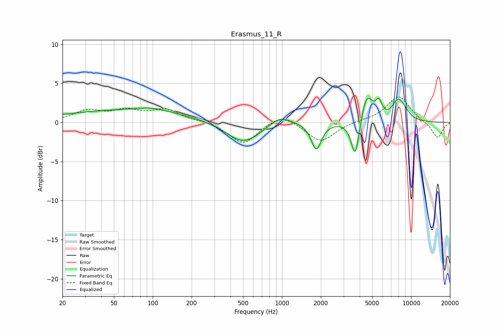

# Erasmus_11_R
See [usage instructions](https://github.com/jaakkopasanen/AutoEq#usage) for more options and info.

### Parametric EQs
Apply preamp of -3.2 dB when using parametric equalizer.

|   # | Type    |   Fc (Hz) |    Q |   Gain (dB) |
|-----|---------|-----------|------|-------------|
|   1 | Peaking |        62 | 0.26 |         1.5 |
|   2 | Peaking |        97 | 1.22 |         0.5 |
|   3 | Peaking |       504 | 1.04 |        -2.8 |
|   4 | Peaking |       964 | 1.63 |         1.3 |
|   5 | Peaking |      1844 | 3.72 |        -3.4 |
|   6 | Peaking |      3701 | 4.46 |        -5.2 |
|   7 | Peaking |      4528 | 2.97 |         3.8 |
|   8 | Peaking |      5623 | 6    |         1.8 |
|   9 | Peaking |      7930 | 2.82 |         2.4 |
|  10 | Peaking |      8886 | 2.88 |         0.7 |

### Fixed Band EQs
When using fixed band (also called graphic) equalizer, apply preamp of **-3.4 dB** (if available) and set gains manually with these parameters.

|   # | Type    |   Fc (Hz) |    Q |   Gain (dB) |
|-----|---------|-----------|------|-------------|
|   1 | Peaking |        31 | 1.41 |         1.4 |
|   2 | Peaking |        62 | 1.41 |         1.3 |
|   3 | Peaking |       125 | 1.41 |         1.5 |
|   4 | Peaking |       250 | 1.41 |         0.2 |
|   5 | Peaking |       500 | 1.41 |        -2.8 |
|   6 | Peaking |      1000 | 1.41 |         1.3 |
|   7 | Peaking |      2000 | 1.41 |        -2.5 |
|   8 | Peaking |      4000 | 1.41 |         0.2 |
|   9 | Peaking |      8000 | 1.41 |         3.4 |
|  10 | Peaking |     16000 | 1.41 |        -2.1 |

### Graphs

