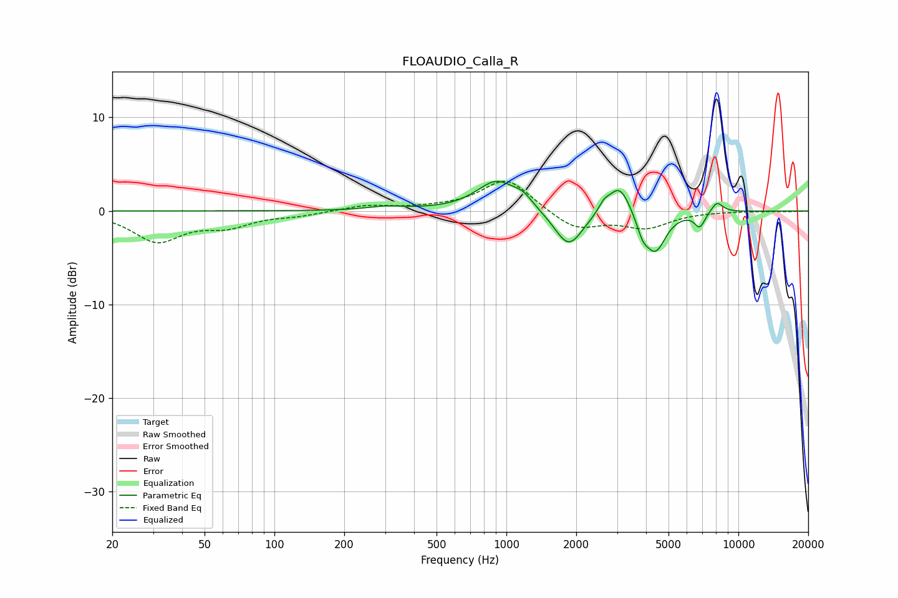

# FLOAUDIO_Calla_R
See [usage instructions](https://github.com/jaakkopasanen/AutoEq#usage) for more options and info.

### Parametric EQs
Apply preamp of -3.3 dB when using parametric equalizer.

|   # | Type    |   Fc (Hz) |    Q |   Gain (dB) |
|-----|---------|-----------|------|-------------|
|   1 | Peaking |       304 | 1.74 |         0.4 |
|   2 | Peaking |       908 | 1.64 |         3.2 |
|   3 | Peaking |      1180 | 3.44 |         0.9 |
|   4 | Peaking |      1856 | 2.28 |        -4   |
|   5 | Peaking |      2636 | 5.84 |         0.9 |
|   6 | Peaking |      3074 | 3.03 |         3.2 |
|   7 | Peaking |      3867 | 5.45 |        -1.6 |
|   8 | Peaking |      4392 | 3.12 |        -4.2 |
|   9 | Peaking |      6817 | 6    |        -1.6 |
|  10 | Peaking |      8087 | 5.08 |         1.2 |

### Fixed Band EQs
When using fixed band (also called graphic) equalizer, apply preamp of **-3.3 dB** (if available) and set gains manually with these parameters.

|   # | Type    |   Fc (Hz) |    Q |   Gain (dB) |
|-----|---------|-----------|------|-------------|
|   1 | Peaking |        31 | 1.41 |        -3.1 |
|   2 | Peaking |        62 | 1.41 |        -1.4 |
|   3 | Peaking |       125 | 1.41 |        -0.4 |
|   4 | Peaking |       250 | 1.41 |         0.6 |
|   5 | Peaking |       500 | 1.41 |         0.2 |
|   6 | Peaking |      1000 | 1.41 |         3.5 |
|   7 | Peaking |      2000 | 1.41 |        -2   |
|   8 | Peaking |      4000 | 1.41 |        -1.7 |
|   9 | Peaking |      8000 | 1.41 |        -0   |
|  10 | Peaking |     16000 | 1.41 |        -0.1 |

### Graphs

