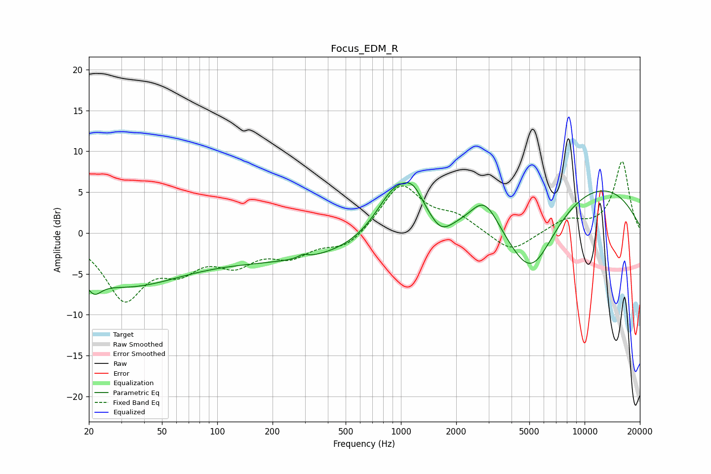

# Focus_EDM_R
See [usage instructions](https://github.com/jaakkopasanen/AutoEq#usage) for more options and info.

### Parametric EQs
Apply preamp of -6.2 dB when using parametric equalizer.

|   # | Type    |   Fc (Hz) |    Q |   Gain (dB) |
|-----|---------|-----------|------|-------------|
|   1 | Peaking |        21 | 3.6  |        -1.8 |
|   2 | Peaking |        31 | 0.42 |        -6.1 |
|   3 | Peaking |       293 | 5.94 |         0.4 |
|   4 | Peaking |       296 | 0.29 |        -3.2 |
|   5 | Peaking |       917 | 1.29 |         6   |
|   6 | Peaking |      1165 | 2.3  |         3   |
|   7 | Peaking |      1656 | 2.51 |        -1.6 |
|   8 | Peaking |      2851 | 1.76 |         4.2 |
|   9 | Peaking |      5109 | 0.96 |        -9.7 |
|  10 | Peaking |      9581 | 0.31 |         6.8 |

### Fixed Band EQs
When using fixed band (also called graphic) equalizer, apply preamp of **-8.8 dB** (if available) and set gains manually with these parameters.

|   # | Type    |   Fc (Hz) |    Q |   Gain (dB) |
|-----|---------|-----------|------|-------------|
|   1 | Peaking |        31 | 1.41 |        -7.7 |
|   2 | Peaking |        62 | 1.41 |        -3.5 |
|   3 | Peaking |       125 | 1.41 |        -3.2 |
|   4 | Peaking |       250 | 1.41 |        -2.4 |
|   5 | Peaking |       500 | 1.41 |        -1.9 |
|   6 | Peaking |      1000 | 1.41 |         5.9 |
|   7 | Peaking |      2000 | 1.41 |         1.8 |
|   8 | Peaking |      4000 | 1.41 |        -2.5 |
|   9 | Peaking |      8000 | 1.41 |         1.5 |
|  10 | Peaking |     16000 | 1.41 |         8.7 |

### Graphs

