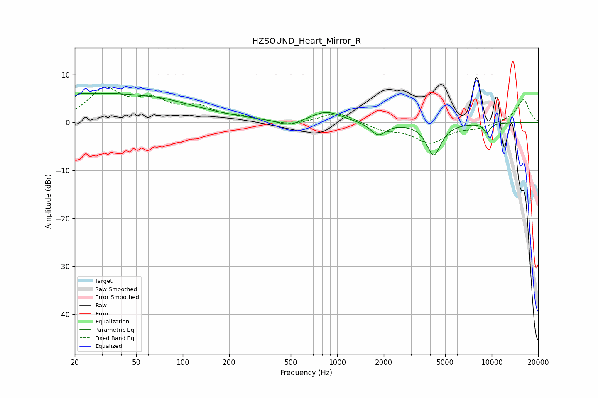

# HZSOUND_Heart_Mirror_R
See [usage instructions](https://github.com/jaakkopasanen/AutoEq#usage) for more options and info.

### Parametric EQs
Apply preamp of -6.2 dB when using parametric equalizer.

|   # | Type    |   Fc (Hz) |    Q |   Gain (dB) |
|-----|---------|-----------|------|-------------|
|   1 | Peaking |        20 | 5.9  |        -3.8 |
|   2 | Peaking |        20 | 5.87 |         3.3 |
|   3 | Peaking |        23 | 0.18 |         4.9 |
|   4 | Peaking |        38 | 0.33 |         1.2 |
|   5 | Peaking |        78 | 1.54 |         0.2 |
|   6 | Peaking |       491 | 1.91 |        -1.3 |
|   7 | Peaking |       850 | 1.46 |         2.3 |
|   8 | Peaking |      1845 | 2.93 |        -2.7 |
|   9 | Peaking |      4216 | 3.03 |        -6.8 |
|  10 | Peaking |      9302 | 5.77 |        -2   |

### Fixed Band EQs
When using fixed band (also called graphic) equalizer, apply preamp of **-7.4 dB** (if available) and set gains manually with these parameters.

|   # | Type    |   Fc (Hz) |    Q |   Gain (dB) |
|-----|---------|-----------|------|-------------|
|   1 | Peaking |        31 | 1.41 |         6.5 |
|   2 | Peaking |        62 | 1.41 |         3.9 |
|   3 | Peaking |       125 | 1.41 |         2.7 |
|   4 | Peaking |       250 | 1.41 |         0.8 |
|   5 | Peaking |       500 | 1.41 |        -0.8 |
|   6 | Peaking |      1000 | 1.41 |         2.2 |
|   7 | Peaking |      2000 | 1.41 |        -1.4 |
|   8 | Peaking |      4000 | 1.41 |        -4.1 |
|   9 | Peaking |      8000 | 1.41 |        -1   |
|  10 | Peaking |     16000 | 1.41 |         4.8 |

### Graphs

