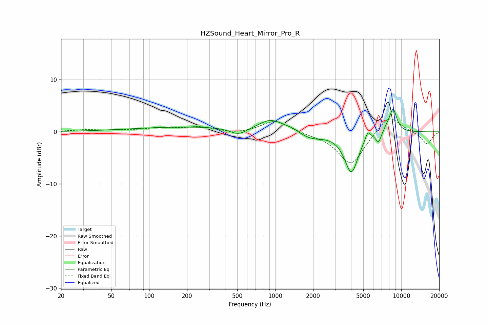

# HZSound_Heart_Mirror_Pro_R
See [usage instructions](https://github.com/jaakkopasanen/AutoEq#usage) for more options and info.

### Parametric EQs
Apply preamp of -4.4 dB when using parametric equalizer.

|   # | Type    |   Fc (Hz) |    Q |   Gain (dB) |
|-----|---------|-----------|------|-------------|
|   1 | Peaking |       223 | 0.28 |         0.9 |
|   2 | Peaking |       512 | 2.02 |        -1.4 |
|   3 | Peaking |       925 | 1.51 |         2.1 |
|   4 | Peaking |      1346 | 2.12 |         0.6 |
|   5 | Peaking |      1907 | 1.42 |        -1.4 |
|   6 | Peaking |      4021 | 2.56 |        -7.7 |
|   7 | Peaking |      5432 | 5.97 |         1.8 |
|   8 | Peaking |      6615 | 6    |        -2   |
|   9 | Peaking |      7745 | 3.19 |         0.8 |
|  10 | Peaking |      8628 | 4.34 |         4.3 |

### Fixed Band EQs
When using fixed band (also called graphic) equalizer, apply preamp of **-2.6 dB** (if available) and set gains manually with these parameters.

|   # | Type    |   Fc (Hz) |    Q |   Gain (dB) |
|-----|---------|-----------|------|-------------|
|   1 | Peaking |        31 | 1.41 |         0.3 |
|   2 | Peaking |        62 | 1.41 |         0.2 |
|   3 | Peaking |       125 | 1.41 |         0.7 |
|   4 | Peaking |       250 | 1.41 |         0.9 |
|   5 | Peaking |       500 | 1.41 |        -0.4 |
|   6 | Peaking |      1000 | 1.41 |         2.3 |
|   7 | Peaking |      2000 | 1.41 |        -0.4 |
|   8 | Peaking |      4000 | 1.41 |        -6.4 |
|   9 | Peaking |      8000 | 1.41 |         3.5 |
|  10 | Peaking |     16000 | 1.41 |        -2.4 |

### Graphs

