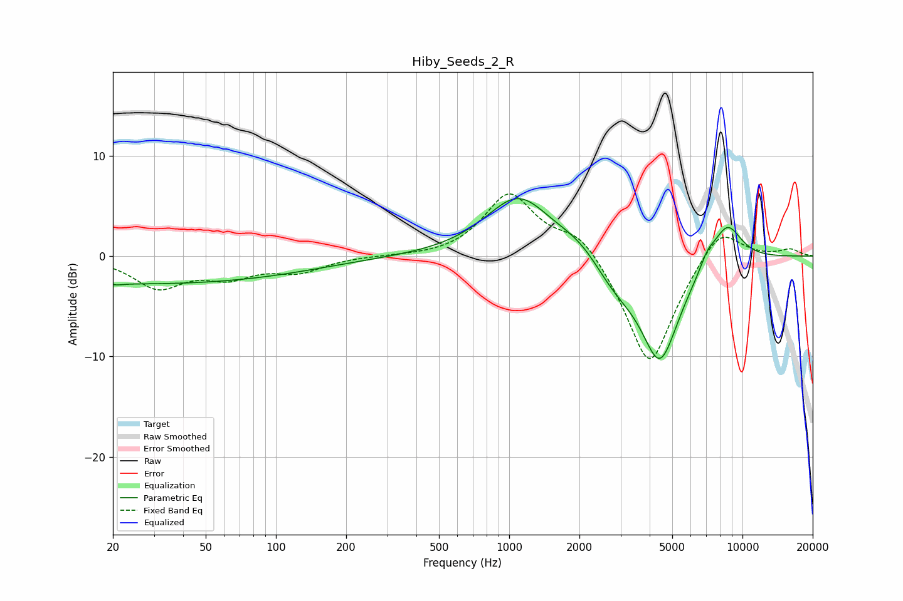

# Hiby_Seeds_2_R
See [usage instructions](https://github.com/jaakkopasanen/AutoEq#usage) for more options and info.

### Parametric EQs
Apply preamp of -5.8 dB when using parametric equalizer.

|   # | Type    |   Fc (Hz) |    Q |   Gain (dB) |
|-----|---------|-----------|------|-------------|
|   1 | Peaking |        20 | 0.25 |        -2.6 |
|   2 | Peaking |        20 | 6    |         2.6 |
|   3 | Peaking |        20 | 5.93 |        -2.7 |
|   4 | Peaking |       102 | 0.48 |        -0.9 |
|   5 | Peaking |      1096 | 1    |         6   |
|   6 | Peaking |      2008 | 1.49 |         1.2 |
|   7 | Peaking |      2837 | 1.46 |        -2.2 |
|   8 | Peaking |      4426 | 1.61 |       -10.4 |
|   9 | Peaking |      7075 | 3.99 |         1.2 |
|  10 | Peaking |      8584 | 2.02 |         4   |

### Fixed Band EQs
When using fixed band (also called graphic) equalizer, apply preamp of **-6.3 dB** (if available) and set gains manually with these parameters.

|   # | Type    |   Fc (Hz) |    Q |   Gain (dB) |
|-----|---------|-----------|------|-------------|
|   1 | Peaking |        31 | 1.41 |        -3   |
|   2 | Peaking |        62 | 1.41 |        -1.8 |
|   3 | Peaking |       125 | 1.41 |        -1.4 |
|   4 | Peaking |       250 | 1.41 |         0   |
|   5 | Peaking |       500 | 1.41 |        -0.1 |
|   6 | Peaking |      1000 | 1.41 |         6.2 |
|   7 | Peaking |      2000 | 1.41 |         2.6 |
|   8 | Peaking |      4000 | 1.41 |       -11.4 |
|   9 | Peaking |      8000 | 1.41 |         3.5 |
|  10 | Peaking |     16000 | 1.41 |         0.7 |

### Graphs

