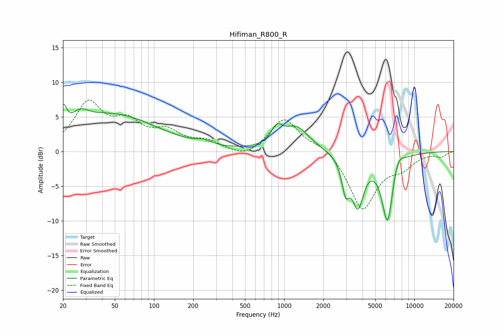

# Hifiman_R800_R
See [usage instructions](https://github.com/jaakkopasanen/AutoEq#usage) for more options and info.

### Parametric EQs
Apply preamp of -6.9 dB when using parametric equalizer.

|   # | Type    |   Fc (Hz) |    Q |   Gain (dB) |
|-----|---------|-----------|------|-------------|
|   1 | Peaking |        20 | 5.79 |         3   |
|   2 | Peaking |        27 | 2.39 |         1.6 |
|   3 | Peaking |        47 | 0.4  |         5.3 |
|   4 | Peaking |       240 | 2.43 |         0.6 |
|   5 | Peaking |       878 | 3.31 |         2.3 |
|   6 | Peaking |      1239 | 1.44 |         3.4 |
|   7 | Peaking |      2962 | 4.77 |        -4.3 |
|   8 | Peaking |      3681 | 3.07 |        -7   |
|   9 | Peaking |      6220 | 3.05 |       -10.2 |
|  10 | Peaking |      7426 | 3.12 |         2.2 |

### Fixed Band EQs
When using fixed band (also called graphic) equalizer, apply preamp of **-7.5 dB** (if available) and set gains manually with these parameters.

|   # | Type    |   Fc (Hz) |    Q |   Gain (dB) |
|-----|---------|-----------|------|-------------|
|   1 | Peaking |        31 | 1.41 |         6.7 |
|   2 | Peaking |        62 | 1.41 |         3.5 |
|   3 | Peaking |       125 | 1.41 |         2.4 |
|   4 | Peaking |       250 | 1.41 |         1.3 |
|   5 | Peaking |       500 | 1.41 |        -1.1 |
|   6 | Peaking |      1000 | 1.41 |         4.8 |
|   7 | Peaking |      2000 | 1.41 |         1.1 |
|   8 | Peaking |      4000 | 1.41 |        -8.3 |
|   9 | Peaking |      8000 | 1.41 |        -1.8 |
|  10 | Peaking |     16000 | 1.41 |        -0.7 |

### Graphs

