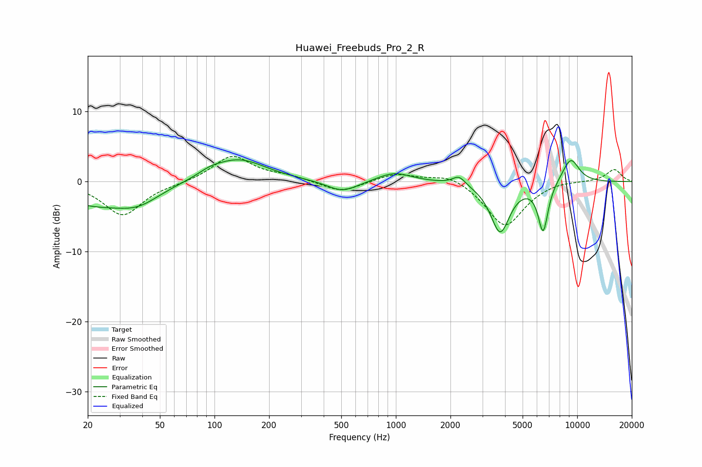

# Huawei_Freebuds_Pro_2_R
See [usage instructions](https://github.com/jaakkopasanen/AutoEq#usage) for more options and info.

### Parametric EQs
Apply preamp of -3.2 dB when using parametric equalizer.

|   # | Type    |   Fc (Hz) |    Q |   Gain (dB) |
|-----|---------|-----------|------|-------------|
|   1 | Peaking |        21 | 0.67 |        -3   |
|   2 | Peaking |        38 | 1.2  |        -2.1 |
|   3 | Peaking |        95 | 2.22 |         0.6 |
|   4 | Peaking |       135 | 0.94 |         3.3 |
|   5 | Peaking |       508 | 1.64 |        -1.6 |
|   6 | Peaking |       979 | 1.53 |         1.4 |
|   7 | Peaking |      2230 | 4.08 |         1.3 |
|   8 | Peaking |      3759 | 2.63 |        -7.2 |
|   9 | Peaking |      6488 | 4.88 |        -7   |
|  10 | Peaking |      9199 | 2.61 |         3.5 |

### Fixed Band EQs
When using fixed band (also called graphic) equalizer, apply preamp of **-3.7 dB** (if available) and set gains manually with these parameters.

|   # | Type    |   Fc (Hz) |    Q |   Gain (dB) |
|-----|---------|-----------|------|-------------|
|   1 | Peaking |        31 | 1.41 |        -4.8 |
|   2 | Peaking |        62 | 1.41 |        -0.2 |
|   3 | Peaking |       125 | 1.41 |         3.7 |
|   4 | Peaking |       250 | 1.41 |         0.7 |
|   5 | Peaking |       500 | 1.41 |        -1.6 |
|   6 | Peaking |      1000 | 1.41 |         1.2 |
|   7 | Peaking |      2000 | 1.41 |         1.2 |
|   8 | Peaking |      4000 | 1.41 |        -6.5 |
|   9 | Peaking |      8000 | 1.41 |         0.3 |
|  10 | Peaking |     16000 | 1.41 |         1.8 |

### Graphs

