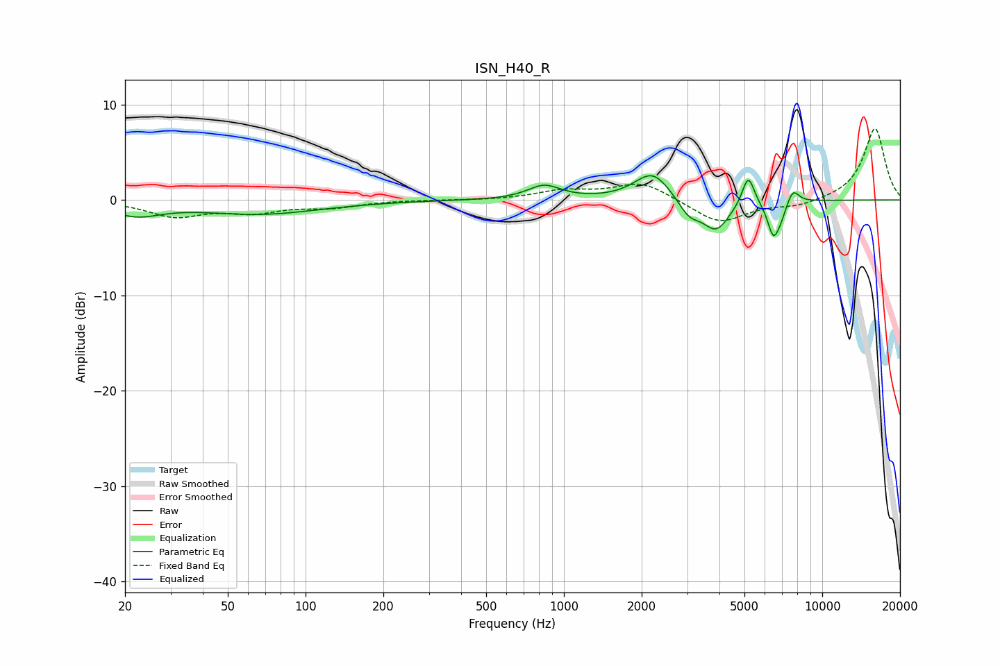

# ISN_H40_R
See [usage instructions](https://github.com/jaakkopasanen/AutoEq#usage) for more options and info.

### Parametric EQs
Apply preamp of -2.6 dB when using parametric equalizer.

|   # | Type    |   Fc (Hz) |    Q |   Gain (dB) |
|-----|---------|-----------|------|-------------|
|   1 | Peaking |        22 | 1.5  |        -1.4 |
|   2 | Peaking |        66 | 0.59 |        -1.4 |
|   3 | Peaking |       839 | 2.23 |         1.5 |
|   4 | Peaking |      2205 | 2.03 |         3   |
|   5 | Peaking |      3050 | 3.28 |        -1.7 |
|   6 | Peaking |      3885 | 2.66 |        -3.1 |
|   7 | Peaking |      5171 | 5.94 |         3.2 |
|   8 | Peaking |      6463 | 6    |        -3.3 |
|   9 | Peaking |      6891 | 5.7  |        -1.2 |
|  10 | Peaking |      7701 | 5.78 |         1.5 |

### Fixed Band EQs
When using fixed band (also called graphic) equalizer, apply preamp of **-7.6 dB** (if available) and set gains manually with these parameters.

|   # | Type    |   Fc (Hz) |    Q |   Gain (dB) |
|-----|---------|-----------|------|-------------|
|   1 | Peaking |        31 | 1.41 |        -1.6 |
|   2 | Peaking |        62 | 1.41 |        -1.1 |
|   3 | Peaking |       125 | 1.41 |        -0.7 |
|   4 | Peaking |       250 | 1.41 |         0   |
|   5 | Peaking |       500 | 1.41 |        -0   |
|   6 | Peaking |      1000 | 1.41 |         0.9 |
|   7 | Peaking |      2000 | 1.41 |         1.9 |
|   8 | Peaking |      4000 | 1.41 |        -2.5 |
|   9 | Peaking |      8000 | 1.41 |        -0.7 |
|  10 | Peaking |     16000 | 1.41 |         7.6 |

### Graphs

