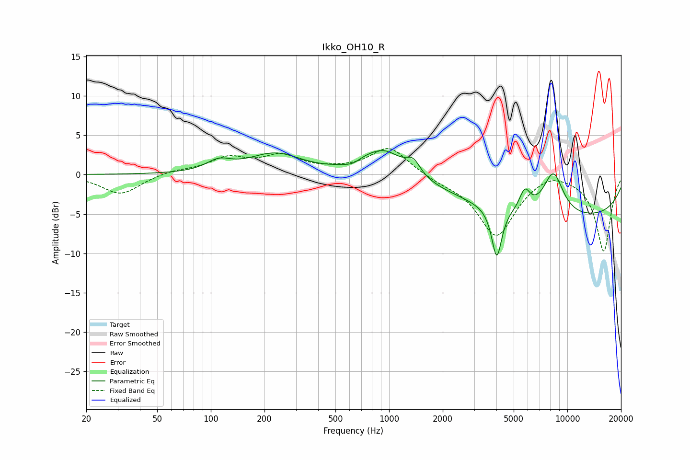

# Ikko_OH10_R
See [usage instructions](https://github.com/jaakkopasanen/AutoEq#usage) for more options and info.

### Parametric EQs
Apply preamp of -3.1 dB when using parametric equalizer.

|   # | Type    |   Fc (Hz) |    Q |   Gain (dB) |
|-----|---------|-----------|------|-------------|
|   1 | Peaking |       111 | 2.08 |         1.3 |
|   2 | Peaking |       229 | 0.96 |         2.6 |
|   3 | Peaking |       637 | 2.57 |        -1.2 |
|   4 | Peaking |       673 | 1.93 |         1.3 |
|   5 | Peaking |       946 | 1.37 |         3.2 |
|   6 | Peaking |      1365 | 3.54 |         1.8 |
|   7 | Peaking |      4018 | 5    |        -6.5 |
|   8 | Peaking |      5773 | 4.64 |         2.5 |
|   9 | Peaking |      8337 | 2.27 |         5.5 |
|  10 | Peaking |      9840 | 0.2  |        -5.6 |

### Fixed Band EQs
When using fixed band (also called graphic) equalizer, apply preamp of **-3.4 dB** (if available) and set gains manually with these parameters.

|   # | Type    |   Fc (Hz) |    Q |   Gain (dB) |
|-----|---------|-----------|------|-------------|
|   1 | Peaking |        31 | 1.41 |        -2.5 |
|   2 | Peaking |        62 | 1.41 |         0.5 |
|   3 | Peaking |       125 | 1.41 |         1.9 |
|   4 | Peaking |       250 | 1.41 |         2.2 |
|   5 | Peaking |       500 | 1.41 |         0.3 |
|   6 | Peaking |      1000 | 1.41 |         3.5 |
|   7 | Peaking |      2000 | 1.41 |        -0.6 |
|   8 | Peaking |      4000 | 1.41 |        -7.7 |
|   9 | Peaking |      8000 | 1.41 |         0.9 |
|  10 | Peaking |     16000 | 1.41 |        -9.7 |

### Graphs

