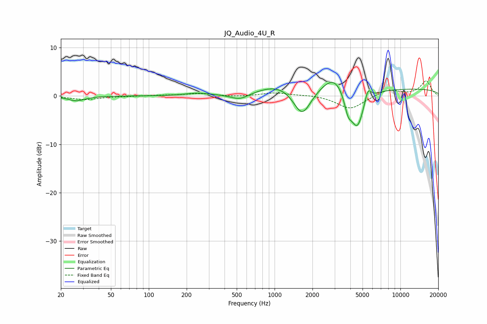

# JQ_Audio_4U_R
See [usage instructions](https://github.com/jaakkopasanen/AutoEq#usage) for more options and info.

### Parametric EQs
Apply preamp of -2.9 dB when using parametric equalizer.

|   # | Type    |   Fc (Hz) |    Q |   Gain (dB) |
|-----|---------|-----------|------|-------------|
|   1 | Peaking |        27 | 2.13 |        -1   |
|   2 | Peaking |       244 | 1.45 |         0.5 |
|   3 | Peaking |       530 | 1.94 |        -1.3 |
|   4 | Peaking |      1088 | 0.86 |         2.3 |
|   5 | Peaking |      1653 | 1.99 |        -5.8 |
|   6 | Peaking |      2997 | 1.42 |         3.9 |
|   7 | Peaking |      3831 | 4.56 |        -3.6 |
|   8 | Peaking |      4543 | 2.54 |        -8.2 |
|   9 | Peaking |      5513 | 5.56 |         2.8 |
|  10 | Peaking |     10000 | 0.18 |         1.5 |

### Fixed Band EQs
When using fixed band (also called graphic) equalizer, apply preamp of **-3.2 dB** (if available) and set gains manually with these parameters.

|   # | Type    |   Fc (Hz) |    Q |   Gain (dB) |
|-----|---------|-----------|------|-------------|
|   1 | Peaking |        31 | 1.41 |        -0.8 |
|   2 | Peaking |        62 | 1.41 |        -0.1 |
|   3 | Peaking |       125 | 1.41 |         0.1 |
|   4 | Peaking |       250 | 1.41 |         0.5 |
|   5 | Peaking |       500 | 1.41 |        -0.2 |
|   6 | Peaking |      1000 | 1.41 |         0.7 |
|   7 | Peaking |      2000 | 1.41 |         0.2 |
|   8 | Peaking |      4000 | 1.41 |        -2.7 |
|   9 | Peaking |      8000 | 1.41 |         1.4 |
|  10 | Peaking |     16000 | 1.41 |         3.1 |

### Graphs

