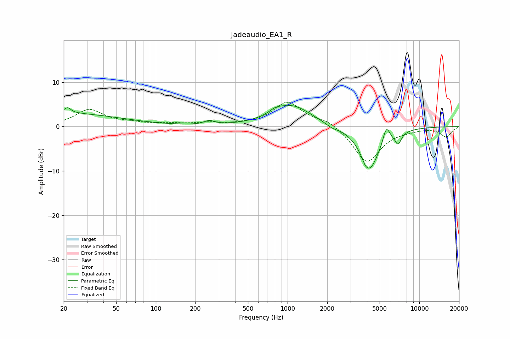

# Jadeaudio_EA1_R
See [usage instructions](https://github.com/jaakkopasanen/AutoEq#usage) for more options and info.

### Parametric EQs
Apply preamp of -4.9 dB when using parametric equalizer.

|   # | Type    |   Fc (Hz) |    Q |   Gain (dB) |
|-----|---------|-----------|------|-------------|
|   1 | Peaking |        20 | 0.33 |         3   |
|   2 | Peaking |        21 | 5.71 |         1.3 |
|   3 | Peaking |       254 | 3.54 |         0.9 |
|   4 | Peaking |       809 | 3.05 |         0.8 |
|   5 | Peaking |      1078 | 0.96 |         4.8 |
|   6 | Peaking |      2171 | 3.24 |        -0.6 |
|   7 | Peaking |      3898 | 6    |        -0.9 |
|   8 | Peaking |      4223 | 1.85 |        -9.4 |
|   9 | Peaking |      5614 | 5.54 |         3.5 |
|  10 | Peaking |      6900 | 5.47 |        -2.6 |

### Fixed Band EQs
When using fixed band (also called graphic) equalizer, apply preamp of **-5.6 dB** (if available) and set gains manually with these parameters.

|   # | Type    |   Fc (Hz) |    Q |   Gain (dB) |
|-----|---------|-----------|------|-------------|
|   1 | Peaking |        31 | 1.41 |         3.7 |
|   2 | Peaking |        62 | 1.41 |         0.6 |
|   3 | Peaking |       125 | 1.41 |         0.5 |
|   4 | Peaking |       250 | 1.41 |         0.7 |
|   5 | Peaking |       500 | 1.41 |         0.3 |
|   6 | Peaking |      1000 | 1.41 |         5.4 |
|   7 | Peaking |      2000 | 1.41 |         1.5 |
|   8 | Peaking |      4000 | 1.41 |        -8.2 |
|   9 | Peaking |      8000 | 1.41 |        -0.5 |
|  10 | Peaking |     16000 | 1.41 |        -2.3 |

### Graphs

