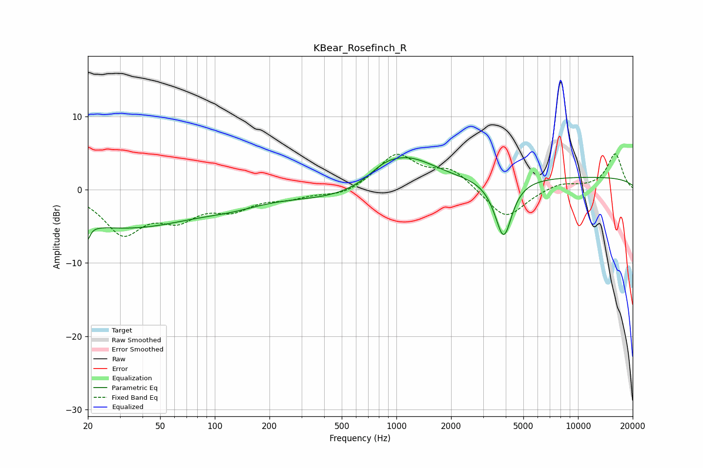

# KBear_Rosefinch_R
See [usage instructions](https://github.com/jaakkopasanen/AutoEq#usage) for more options and info.

### Parametric EQs
Apply preamp of -4.5 dB when using parametric equalizer.

|   # | Type    |   Fc (Hz) |    Q |   Gain (dB) |
|-----|---------|-----------|------|-------------|
|   1 | Peaking |        20 | 5.9  |        -5.4 |
|   2 | Peaking |        20 | 5.96 |         3.2 |
|   3 | Peaking |        32 | 0.36 |        -5.1 |
|   4 | Peaking |       125 | 0.87 |        -1   |
|   5 | Peaking |       518 | 0.53 |        -1.6 |
|   6 | Peaking |       847 | 1.71 |         1.1 |
|   7 | Peaking |      1128 | 0.84 |         4.5 |
|   8 | Peaking |      3745 | 2.27 |        -1.5 |
|   9 | Peaking |      3907 | 3.24 |        -6.5 |
|  10 | Peaking |     10000 | 0.18 |         1.8 |

### Fixed Band EQs
When using fixed band (also called graphic) equalizer, apply preamp of **-5.0 dB** (if available) and set gains manually with these parameters.

|   # | Type    |   Fc (Hz) |    Q |   Gain (dB) |
|-----|---------|-----------|------|-------------|
|   1 | Peaking |        31 | 1.41 |        -5.7 |
|   2 | Peaking |        62 | 1.41 |        -3.3 |
|   3 | Peaking |       125 | 1.41 |        -2.3 |
|   4 | Peaking |       250 | 1.41 |        -0.9 |
|   5 | Peaking |       500 | 1.41 |        -0.9 |
|   6 | Peaking |      1000 | 1.41 |         4.7 |
|   7 | Peaking |      2000 | 1.41 |         2.6 |
|   8 | Peaking |      4000 | 1.41 |        -4.1 |
|   9 | Peaking |      8000 | 1.41 |         0.9 |
|  10 | Peaking |     16000 | 1.41 |         4.9 |

### Graphs

