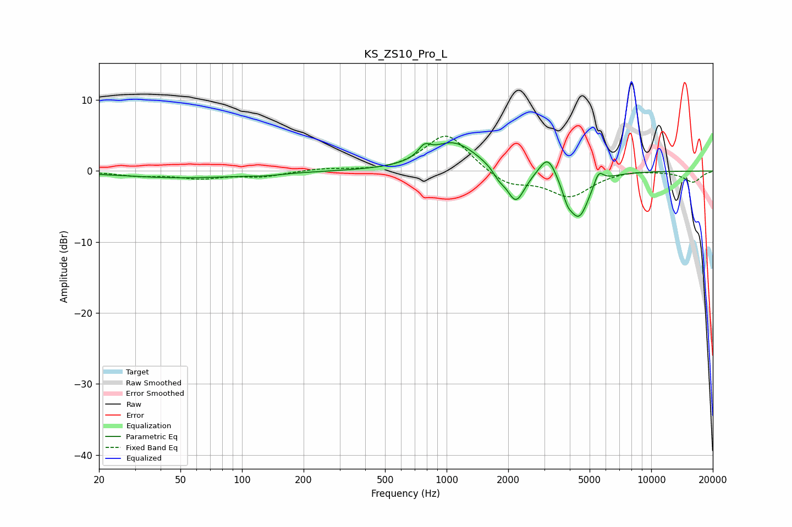

# KS_ZS10_Pro_L
See [usage instructions](https://github.com/jaakkopasanen/AutoEq#usage) for more options and info.

### Parametric EQs
Apply preamp of -4.1 dB when using parametric equalizer.

|   # | Type    |   Fc (Hz) |    Q |   Gain (dB) |
|-----|---------|-----------|------|-------------|
|   1 | Peaking |        52 | 0.45 |        -0.9 |
|   2 | Peaking |       131 | 1.94 |        -0.2 |
|   3 | Peaking |       779 | 4.91 |         1.5 |
|   4 | Peaking |      1081 | 1.21 |         4.1 |
|   5 | Peaking |      1801 | 4.87 |        -1.1 |
|   6 | Peaking |      2179 | 3.19 |        -4.7 |
|   7 | Peaking |      3125 | 3.5  |         3.1 |
|   8 | Peaking |      3891 | 6    |        -1.6 |
|   9 | Peaking |      4426 | 2.65 |        -6.5 |
|  10 | Peaking |      5533 | 6    |         1.9 |

### Fixed Band EQs
When using fixed band (also called graphic) equalizer, apply preamp of **-5.0 dB** (if available) and set gains manually with these parameters.

|   # | Type    |   Fc (Hz) |    Q |   Gain (dB) |
|-----|---------|-----------|------|-------------|
|   1 | Peaking |        31 | 1.41 |        -0.6 |
|   2 | Peaking |        62 | 1.41 |        -0.9 |
|   3 | Peaking |       125 | 1.41 |        -0.7 |
|   4 | Peaking |       250 | 1.41 |         0.3 |
|   5 | Peaking |       500 | 1.41 |        -0.2 |
|   6 | Peaking |      1000 | 1.41 |         5.4 |
|   7 | Peaking |      2000 | 1.41 |        -2.1 |
|   8 | Peaking |      4000 | 1.41 |        -3.5 |
|   9 | Peaking |      8000 | 1.41 |         0.3 |
|  10 | Peaking |     16000 | 1.41 |        -1.6 |

### Graphs

