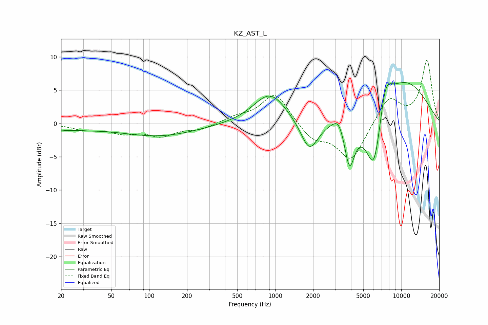

# KZ_AST_L
See [usage instructions](https://github.com/jaakkopasanen/AutoEq#usage) for more options and info.

### Parametric EQs
Apply preamp of -6.3 dB when using parametric equalizer.

|   # | Type    |   Fc (Hz) |    Q |   Gain (dB) |
|-----|---------|-----------|------|-------------|
|   1 | Peaking |        20 | 2.37 |        -0.4 |
|   2 | Peaking |        29 | 0.9  |        -0.5 |
|   3 | Peaking |       118 | 0.46 |        -1.9 |
|   4 | Peaking |       911 | 1.1  |         4.6 |
|   5 | Peaking |      1869 | 2.01 |        -4.8 |
|   6 | Peaking |      3201 | 3.03 |         2.1 |
|   7 | Peaking |      3883 | 3.34 |        -7   |
|   8 | Peaking |      6101 | 1.88 |       -11.6 |
|   9 | Peaking |      7461 | 2.55 |         5.4 |
|  10 | Peaking |      9986 | 0.5  |         7   |

### Fixed Band EQs
When using fixed band (also called graphic) equalizer, apply preamp of **-9.6 dB** (if available) and set gains manually with these parameters.

|   # | Type    |   Fc (Hz) |    Q |   Gain (dB) |
|-----|---------|-----------|------|-------------|
|   1 | Peaking |        31 | 1.41 |        -0.8 |
|   2 | Peaking |        62 | 1.41 |        -1.3 |
|   3 | Peaking |       125 | 1.41 |        -1.7 |
|   4 | Peaking |       250 | 1.41 |        -0.8 |
|   5 | Peaking |       500 | 1.41 |         0.8 |
|   6 | Peaking |      1000 | 1.41 |         4.7 |
|   7 | Peaking |      2000 | 1.41 |        -2.3 |
|   8 | Peaking |      4000 | 1.41 |        -5.6 |
|   9 | Peaking |      8000 | 1.41 |         4   |
|  10 | Peaking |     16000 | 1.41 |         9.5 |

### Graphs

