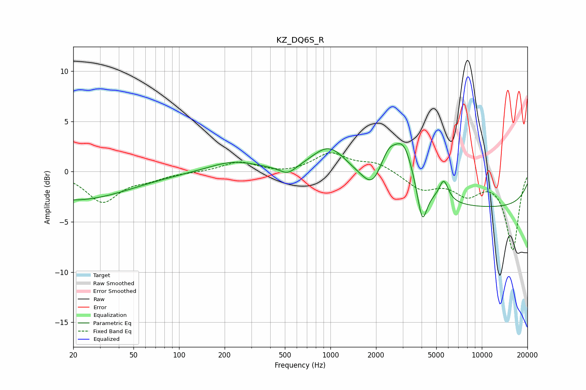

# KZ_DQ6S_R
See [usage instructions](https://github.com/jaakkopasanen/AutoEq#usage) for more options and info.

### Parametric EQs
Apply preamp of -2.9 dB when using parametric equalizer.

|   # | Type    |   Fc (Hz) |    Q |   Gain (dB) |
|-----|---------|-----------|------|-------------|
|   1 | Peaking |        20 | 0.38 |        -2.8 |
|   2 | Peaking |       226 | 0.89 |         1   |
|   3 | Peaking |       523 | 2.57 |        -0.9 |
|   4 | Peaking |       983 | 1.23 |         2.8 |
|   5 | Peaking |      1891 | 2.32 |        -1.7 |
|   6 | Peaking |      2420 | 2.39 |         2.7 |
|   7 | Peaking |      3060 | 2.21 |         4.2 |
|   8 | Peaking |      4041 | 4.64 |        -3.7 |
|   9 | Peaking |      5602 | 4.53 |         2.1 |
|  10 | Peaking |     10000 | 0.18 |        -3.6 |

### Fixed Band EQs
When using fixed band (also called graphic) equalizer, apply preamp of **-2.0 dB** (if available) and set gains manually with these parameters.

|   # | Type    |   Fc (Hz) |    Q |   Gain (dB) |
|-----|---------|-----------|------|-------------|
|   1 | Peaking |        31 | 1.41 |        -3   |
|   2 | Peaking |        62 | 1.41 |        -0.6 |
|   3 | Peaking |       125 | 1.41 |        -0   |
|   4 | Peaking |       250 | 1.41 |         1   |
|   5 | Peaking |       500 | 1.41 |        -0.2 |
|   6 | Peaking |      1000 | 1.41 |         1.8 |
|   7 | Peaking |      2000 | 1.41 |         0.9 |
|   8 | Peaking |      4000 | 1.41 |        -1.7 |
|   9 | Peaking |      8000 | 1.41 |        -2   |
|  10 | Peaking |     16000 | 1.41 |        -7.7 |

### Graphs

