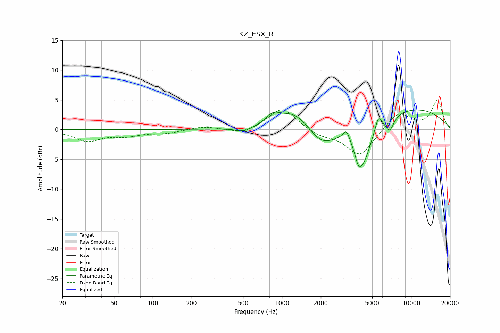

# KZ_ESX_R
See [usage instructions](https://github.com/jaakkopasanen/AutoEq#usage) for more options and info.

### Parametric EQs
Apply preamp of -3.4 dB when using parametric equalizer.

|   # | Type    |   Fc (Hz) |    Q |   Gain (dB) |
|-----|---------|-----------|------|-------------|
|   1 | Peaking |       507 | 2.36 |        -0.8 |
|   2 | Peaking |       852 | 2.83 |         1.4 |
|   3 | Peaking |      1263 | 1.04 |         3.5 |
|   4 | Peaking |      2026 | 1.2  |        -3.7 |
|   5 | Peaking |      3154 | 5.6  |         1.8 |
|   6 | Peaking |      3907 | 5.87 |        -1.8 |
|   7 | Peaking |      4241 | 2.14 |        -6.8 |
|   8 | Peaking |      5591 | 5.42 |         2.3 |
|   9 | Peaking |      6824 | 4.14 |        -2.4 |
|  10 | Peaking |      9768 | 0.35 |         3.6 |

### Fixed Band EQs
When using fixed band (also called graphic) equalizer, apply preamp of **-5.1 dB** (if available) and set gains manually with these parameters.

|   # | Type    |   Fc (Hz) |    Q |   Gain (dB) |
|-----|---------|-----------|------|-------------|
|   1 | Peaking |        31 | 1.41 |        -1.8 |
|   2 | Peaking |        62 | 1.41 |        -0.9 |
|   3 | Peaking |       125 | 1.41 |        -0.6 |
|   4 | Peaking |       250 | 1.41 |         0.5 |
|   5 | Peaking |       500 | 1.41 |        -0.8 |
|   6 | Peaking |      1000 | 1.41 |         3.7 |
|   7 | Peaking |      2000 | 1.41 |        -1   |
|   8 | Peaking |      4000 | 1.41 |        -4.5 |
|   9 | Peaking |      8000 | 1.41 |         3   |
|  10 | Peaking |     16000 | 1.41 |         4.9 |

### Graphs

