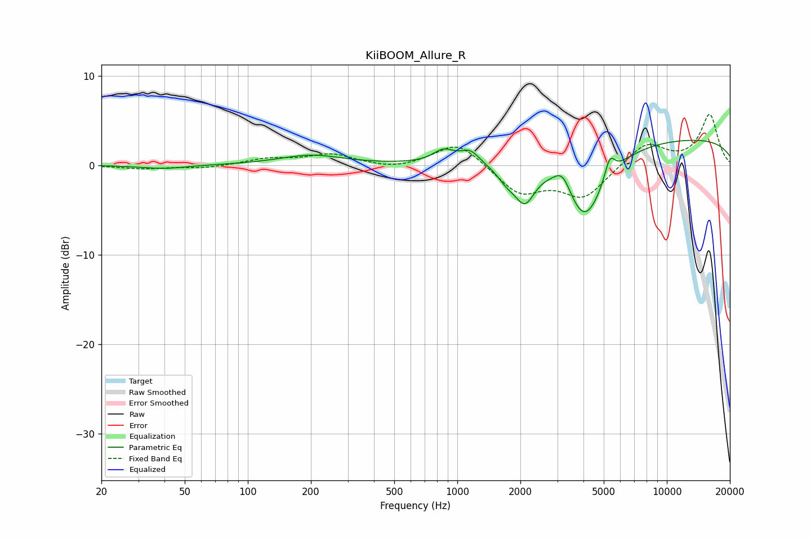

# KiiBOOM_Allure_R
See [usage instructions](https://github.com/jaakkopasanen/AutoEq#usage) for more options and info.

### Parametric EQs
Apply preamp of -2.9 dB when using parametric equalizer.

|   # | Type    |   Fc (Hz) |    Q |   Gain (dB) |
|-----|---------|-----------|------|-------------|
|   1 | Peaking |        40 | 1.34 |        -0.4 |
|   2 | Peaking |       201 | 0.94 |         1.1 |
|   3 | Peaking |       860 | 2.76 |         1.4 |
|   4 | Peaking |      1150 | 3.22 |         1.4 |
|   5 | Peaking |      1724 | 2.82 |        -1.5 |
|   6 | Peaking |      2103 | 2.92 |        -3.9 |
|   7 | Peaking |      3183 | 3.43 |         2.2 |
|   8 | Peaking |      4047 | 1.44 |        -8.2 |
|   9 | Peaking |      5341 | 5.72 |         2.4 |
|  10 | Peaking |      9930 | 0.18 |         3.1 |

### Fixed Band EQs
When using fixed band (also called graphic) equalizer, apply preamp of **-5.8 dB** (if available) and set gains manually with these parameters.

|   # | Type    |   Fc (Hz) |    Q |   Gain (dB) |
|-----|---------|-----------|------|-------------|
|   1 | Peaking |        31 | 1.41 |        -0.4 |
|   2 | Peaking |        62 | 1.41 |        -0.3 |
|   3 | Peaking |       125 | 1.41 |         0.7 |
|   4 | Peaking |       250 | 1.41 |         1.2 |
|   5 | Peaking |       500 | 1.41 |        -0.5 |
|   6 | Peaking |      1000 | 1.41 |         2.7 |
|   7 | Peaking |      2000 | 1.41 |        -3.1 |
|   8 | Peaking |      4000 | 1.41 |        -3.5 |
|   9 | Peaking |      8000 | 1.41 |         2.5 |
|  10 | Peaking |     16000 | 1.41 |         5.6 |

### Graphs

