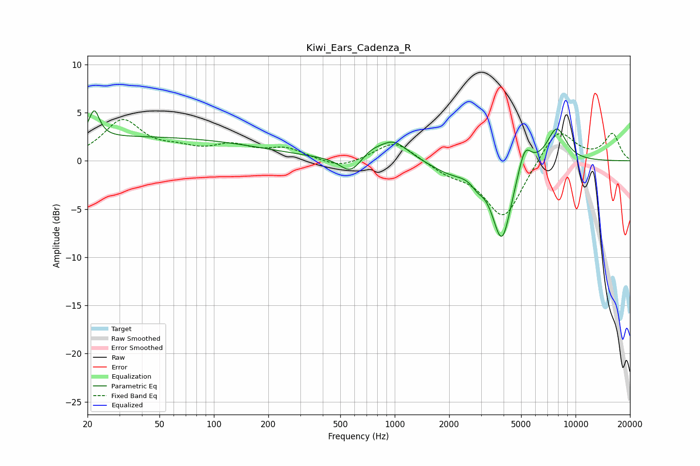

# Kiwi_Ears_Cadenza_R
See [usage instructions](https://github.com/jaakkopasanen/AutoEq#usage) for more options and info.

### Parametric EQs
Apply preamp of -5.3 dB when using parametric equalizer.

|   # | Type    |   Fc (Hz) |    Q |   Gain (dB) |
|-----|---------|-----------|------|-------------|
|   1 | Peaking |        22 | 5.04 |         2.8 |
|   2 | Peaking |        36 | 0.18 |         2.5 |
|   3 | Peaking |       571 | 2.39 |        -1.7 |
|   4 | Peaking |       736 | 2.59 |         0.6 |
|   5 | Peaking |       982 | 1.69 |         2.1 |
|   6 | Peaking |      2016 | 1.37 |        -1.1 |
|   7 | Peaking |      2871 | 4.27 |        -0.8 |
|   8 | Peaking |      3913 | 2.57 |        -8.2 |
|   9 | Peaking |      5229 | 3.83 |         2.8 |
|  10 | Peaking |      7861 | 2.46 |         3.6 |

### Fixed Band EQs
When using fixed band (also called graphic) equalizer, apply preamp of **-4.4 dB** (if available) and set gains manually with these parameters.

|   # | Type    |   Fc (Hz) |    Q |   Gain (dB) |
|-----|---------|-----------|------|-------------|
|   1 | Peaking |        31 | 1.41 |         4.1 |
|   2 | Peaking |        62 | 1.41 |         0.9 |
|   3 | Peaking |       125 | 1.41 |         1.4 |
|   4 | Peaking |       250 | 1.41 |         1.2 |
|   5 | Peaking |       500 | 1.41 |        -0.9 |
|   6 | Peaking |      1000 | 1.41 |         2.2 |
|   7 | Peaking |      2000 | 1.41 |        -1.1 |
|   8 | Peaking |      4000 | 1.41 |        -6   |
|   9 | Peaking |      8000 | 1.41 |         3.5 |
|  10 | Peaking |     16000 | 1.41 |         2.7 |

### Graphs

