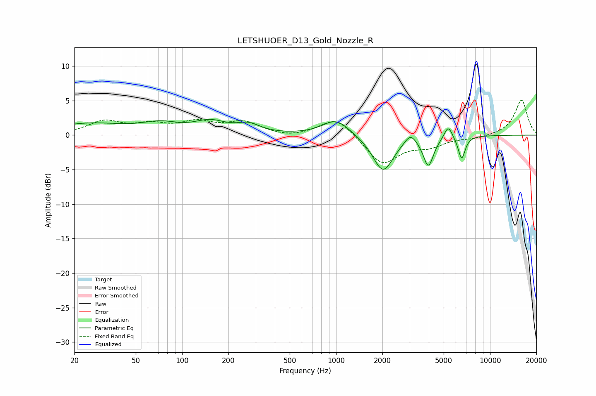

# LETSHUOER_D13_Gold_Nozzle_R
See [usage instructions](https://github.com/jaakkopasanen/AutoEq#usage) for more options and info.

### Parametric EQs
Apply preamp of -2.4 dB when using parametric equalizer.

|   # | Type    |   Fc (Hz) |    Q |   Gain (dB) |
|-----|---------|-----------|------|-------------|
|   1 | Peaking |        25 | 0.58 |         1.6 |
|   2 | Peaking |        72 | 1.18 |         1.3 |
|   3 | Peaking |       152 | 1.34 |         1.7 |
|   4 | Peaking |       271 | 1.87 |         1.2 |
|   5 | Peaking |      1000 | 1.61 |         2.4 |
|   6 | Peaking |      2018 | 2.09 |        -5.3 |
|   7 | Peaking |      3037 | 3.88 |         1.5 |
|   8 | Peaking |      3976 | 4.23 |        -4.3 |
|   9 | Peaking |      5354 | 5.37 |         2   |
|  10 | Peaking |      6541 | 6    |        -3.3 |

### Fixed Band EQs
When using fixed band (also called graphic) equalizer, apply preamp of **-5.1 dB** (if available) and set gains manually with these parameters.

|   # | Type    |   Fc (Hz) |    Q |   Gain (dB) |
|-----|---------|-----------|------|-------------|
|   1 | Peaking |        31 | 1.41 |         1.9 |
|   2 | Peaking |        62 | 1.41 |         1.3 |
|   3 | Peaking |       125 | 1.41 |         1.6 |
|   4 | Peaking |       250 | 1.41 |         1.7 |
|   5 | Peaking |       500 | 1.41 |        -0.4 |
|   6 | Peaking |      1000 | 1.41 |         2.7 |
|   7 | Peaking |      2000 | 1.41 |        -4.2 |
|   8 | Peaking |      4000 | 1.41 |        -1.4 |
|   9 | Peaking |      8000 | 1.41 |        -0.4 |
|  10 | Peaking |     16000 | 1.41 |         5.1 |

### Graphs

