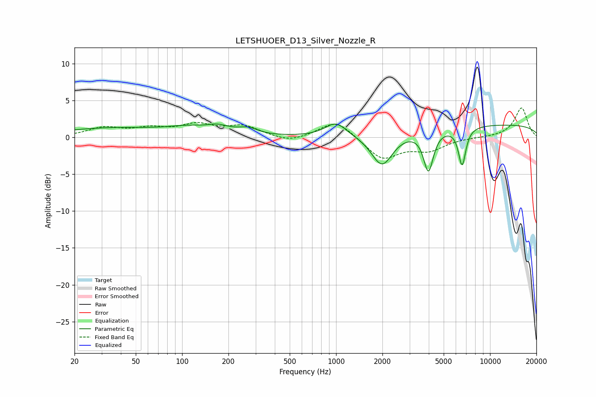

# LETSHUOER_D13_Silver_Nozzle_R
See [usage instructions](https://github.com/jaakkopasanen/AutoEq#usage) for more options and info.

### Parametric EQs
Apply preamp of -1.9 dB when using parametric equalizer.

|   # | Type    |   Fc (Hz) |    Q |   Gain (dB) |
|-----|---------|-----------|------|-------------|
|   1 | Peaking |        35 | 0.41 |         1.2 |
|   2 | Peaking |       111 | 1.03 |         0.8 |
|   3 | Peaking |       148 | 1.76 |        -0.9 |
|   4 | Peaking |       161 | 1.59 |         1.7 |
|   5 | Peaking |       269 | 2.32 |         0.8 |
|   6 | Peaking |       996 | 2.05 |         1.9 |
|   7 | Peaking |      1988 | 2.03 |        -4.5 |
|   8 | Peaking |      3981 | 4.44 |        -5.5 |
|   9 | Peaking |      6585 | 5.71 |        -5.1 |
|  10 | Peaking |     10000 | 0.18 |         1.7 |

### Fixed Band EQs
When using fixed band (also called graphic) equalizer, apply preamp of **-4.1 dB** (if available) and set gains manually with these parameters.

|   # | Type    |   Fc (Hz) |    Q |   Gain (dB) |
|-----|---------|-----------|------|-------------|
|   1 | Peaking |        31 | 1.41 |         1.2 |
|   2 | Peaking |        62 | 1.41 |         1   |
|   3 | Peaking |       125 | 1.41 |         1.5 |
|   4 | Peaking |       250 | 1.41 |         1.4 |
|   5 | Peaking |       500 | 1.41 |        -0.8 |
|   6 | Peaking |      1000 | 1.41 |         2.4 |
|   7 | Peaking |      2000 | 1.41 |        -3   |
|   8 | Peaking |      4000 | 1.41 |        -1.6 |
|   9 | Peaking |      8000 | 1.41 |        -0   |
|  10 | Peaking |     16000 | 1.41 |         4   |

### Graphs

