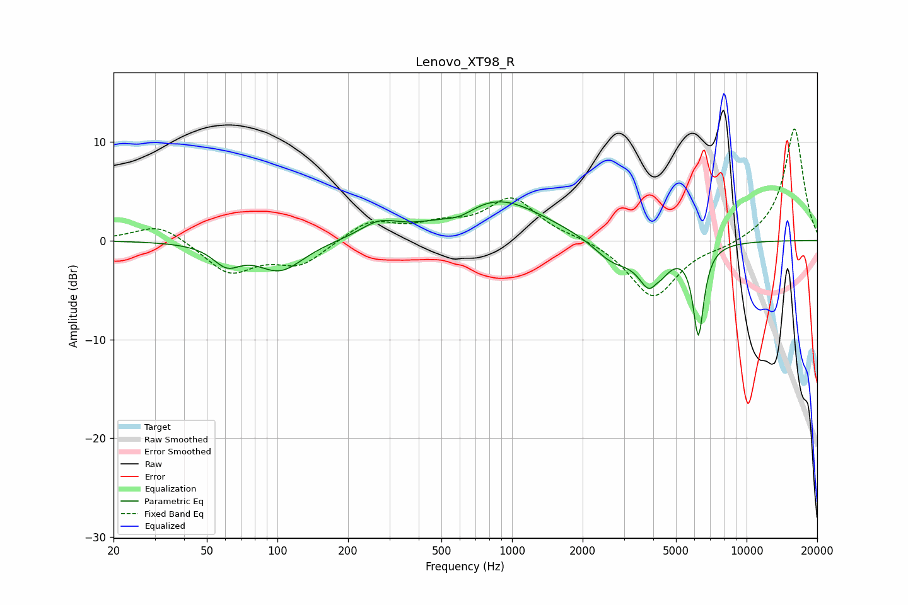

# Lenovo_XT98_R
See [usage instructions](https://github.com/jaakkopasanen/AutoEq#usage) for more options and info.

### Parametric EQs
Apply preamp of -4.0 dB when using parametric equalizer.

|   # | Type    |   Fc (Hz) |    Q |   Gain (dB) |
|-----|---------|-----------|------|-------------|
|   1 | Peaking |        61 | 2.44 |        -2   |
|   2 | Peaking |       103 | 1.41 |        -3   |
|   3 | Peaking |       271 | 1.73 |         1.5 |
|   4 | Peaking |       601 | 2.15 |        -0.9 |
|   5 | Peaking |       861 | 0.71 |         4.2 |
|   6 | Peaking |      2683 | 1.7  |        -2.2 |
|   7 | Peaking |      3967 | 2.65 |        -5.1 |
|   8 | Peaking |      4083 | 5.81 |         1   |
|   9 | Peaking |      6234 | 5.91 |        -9.1 |
|  10 | Peaking |      6474 | 4.78 |         0.1 |

### Fixed Band EQs
When using fixed band (also called graphic) equalizer, apply preamp of **-11.4 dB** (if available) and set gains manually with these parameters.

|   # | Type    |   Fc (Hz) |    Q |   Gain (dB) |
|-----|---------|-----------|------|-------------|
|   1 | Peaking |        31 | 1.41 |         1.8 |
|   2 | Peaking |        62 | 1.41 |        -3.3 |
|   3 | Peaking |       125 | 1.41 |        -2.4 |
|   4 | Peaking |       250 | 1.41 |         2   |
|   5 | Peaking |       500 | 1.41 |         1.2 |
|   6 | Peaking |      1000 | 1.41 |         4.2 |
|   7 | Peaking |      2000 | 1.41 |         0.3 |
|   8 | Peaking |      4000 | 1.41 |        -5.8 |
|   9 | Peaking |      8000 | 1.41 |        -0.5 |
|  10 | Peaking |     16000 | 1.41 |        11.4 |

### Graphs

