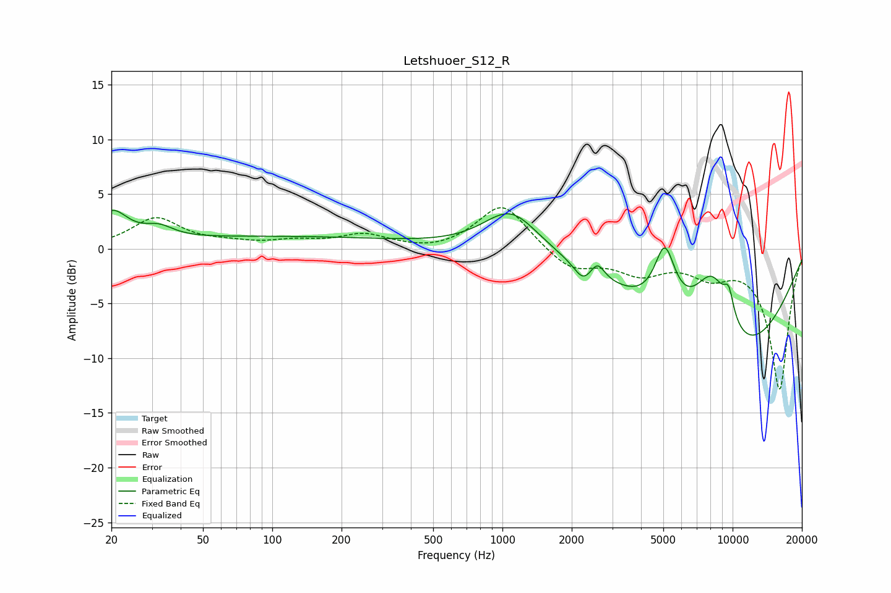

# Letshuoer_S12_R
See [usage instructions](https://github.com/jaakkopasanen/AutoEq#usage) for more options and info.

### Parametric EQs
Apply preamp of -3.6 dB when using parametric equalizer.

|   # | Type    |   Fc (Hz) |    Q |   Gain (dB) |
|-----|---------|-----------|------|-------------|
|   1 | Peaking |        20 | 2.07 |         2.9 |
|   2 | Peaking |        32 | 2.23 |         1   |
|   3 | Peaking |       108 | 0.25 |         1.1 |
|   4 | Peaking |      1090 | 1.19 |         3.8 |
|   5 | Peaking |      2237 | 3.79 |        -1.3 |
|   6 | Peaking |      2590 | 4.8  |         1.4 |
|   7 | Peaking |      5073 | 3.06 |         5.7 |
|   8 | Peaking |      8165 | 1.36 |         8.5 |
|   9 | Peaking |      9224 | 0.41 |       -12.1 |
|  10 | Peaking |      9621 | 5.82 |         2.3 |

### Fixed Band EQs
When using fixed band (also called graphic) equalizer, apply preamp of **-3.9 dB** (if available) and set gains manually with these parameters.

|   # | Type    |   Fc (Hz) |    Q |   Gain (dB) |
|-----|---------|-----------|------|-------------|
|   1 | Peaking |        31 | 1.41 |         2.7 |
|   2 | Peaking |        62 | 1.41 |         0.4 |
|   3 | Peaking |       125 | 1.41 |         0.6 |
|   4 | Peaking |       250 | 1.41 |         1.2 |
|   5 | Peaking |       500 | 1.41 |        -0.3 |
|   6 | Peaking |      1000 | 1.41 |         4.2 |
|   7 | Peaking |      2000 | 1.41 |        -2   |
|   8 | Peaking |      4000 | 1.41 |        -2   |
|   9 | Peaking |      8000 | 1.41 |        -2   |
|  10 | Peaking |     16000 | 1.41 |       -12.8 |

### Graphs

