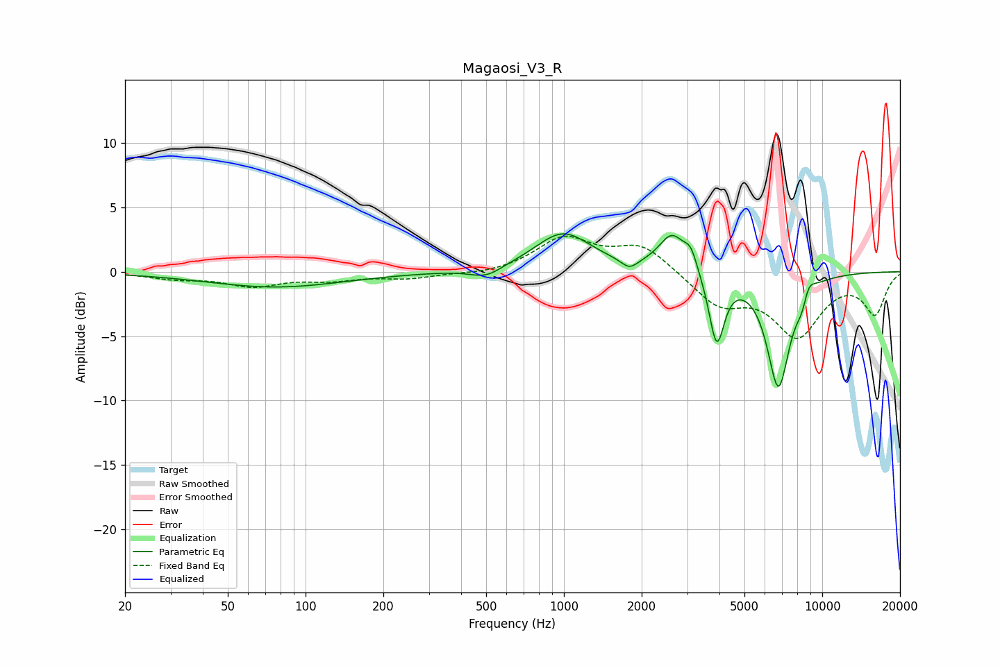

# Magaosi_V3_R
See [usage instructions](https://github.com/jaakkopasanen/AutoEq#usage) for more options and info.

### Parametric EQs
Apply preamp of -3.0 dB when using parametric equalizer.

|   # | Type    |   Fc (Hz) |    Q |   Gain (dB) |
|-----|---------|-----------|------|-------------|
|   1 | Peaking |        76 | 0.53 |        -1.2 |
|   2 | Peaking |       500 | 2.31 |        -0.8 |
|   3 | Peaking |       992 | 1.29 |         3   |
|   4 | Peaking |      1794 | 4.46 |        -0.8 |
|   5 | Peaking |      2623 | 2.74 |         2.8 |
|   6 | Peaking |      3100 | 5.55 |         1.4 |
|   7 | Peaking |      3903 | 4.75 |        -5.5 |
|   8 | Peaking |      6768 | 3.02 |        -8.8 |
|   9 | Peaking |      8417 | 5.31 |        -1.7 |
|  10 | Peaking |      8751 | 4.94 |         1.7 |

### Fixed Band EQs
When using fixed band (also called graphic) equalizer, apply preamp of **-2.8 dB** (if available) and set gains manually with these parameters.

|   # | Type    |   Fc (Hz) |    Q |   Gain (dB) |
|-----|---------|-----------|------|-------------|
|   1 | Peaking |        31 | 1.41 |        -0.5 |
|   2 | Peaking |        62 | 1.41 |        -1   |
|   3 | Peaking |       125 | 1.41 |        -0.5 |
|   4 | Peaking |       250 | 1.41 |        -0.5 |
|   5 | Peaking |       500 | 1.41 |        -0.2 |
|   6 | Peaking |      1000 | 1.41 |         2.5 |
|   7 | Peaking |      2000 | 1.41 |         2.1 |
|   8 | Peaking |      4000 | 1.41 |        -2.4 |
|   9 | Peaking |      8000 | 1.41 |        -4.7 |
|  10 | Peaking |     16000 | 1.41 |        -3.1 |

### Graphs

