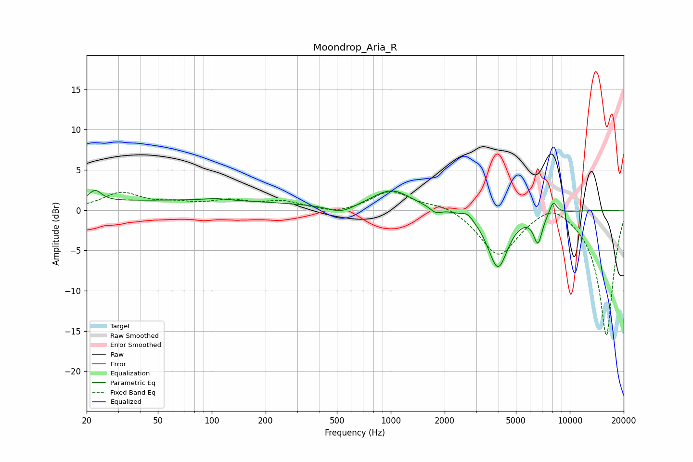

# Moondrop_Aria_R
See [usage instructions](https://github.com/jaakkopasanen/AutoEq#usage) for more options and info.

### Parametric EQs
Apply preamp of -2.5 dB when using parametric equalizer.

|   # | Type    |   Fc (Hz) |    Q |   Gain (dB) |
|-----|---------|-----------|------|-------------|
|   1 | Peaking |        22 | 4.09 |         1.4 |
|   2 | Peaking |        63 | 0.18 |         1.2 |
|   3 | Peaking |       106 | 2.15 |         0.3 |
|   4 | Peaking |       528 | 1.96 |        -1   |
|   5 | Peaking |      1011 | 1.3  |         2.5 |
|   6 | Peaking |      1781 | 4.61 |        -0.7 |
|   7 | Peaking |      2685 | 4.93 |         0.7 |
|   8 | Peaking |      3965 | 2.46 |        -7.1 |
|   9 | Peaking |      6640 | 5.52 |        -3.5 |
|  10 | Peaking |      8070 | 6    |         1.6 |

### Fixed Band EQs
When using fixed band (also called graphic) equalizer, apply preamp of **-2.4 dB** (if available) and set gains manually with these parameters.

|   # | Type    |   Fc (Hz) |    Q |   Gain (dB) |
|-----|---------|-----------|------|-------------|
|   1 | Peaking |        31 | 1.41 |         2.1 |
|   2 | Peaking |        62 | 1.41 |         0.7 |
|   3 | Peaking |       125 | 1.41 |         1   |
|   4 | Peaking |       250 | 1.41 |         1   |
|   5 | Peaking |       500 | 1.41 |        -0.6 |
|   6 | Peaking |      1000 | 1.41 |         2.4 |
|   7 | Peaking |      2000 | 1.41 |         0.8 |
|   8 | Peaking |      4000 | 1.41 |        -5.7 |
|   9 | Peaking |      8000 | 1.41 |         1.6 |
|  10 | Peaking |     16000 | 1.41 |       -15.7 |

### Graphs

